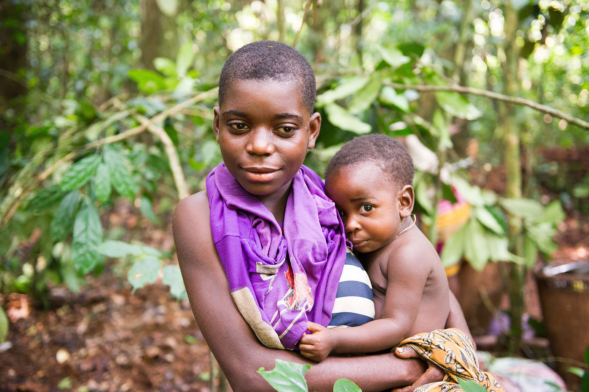
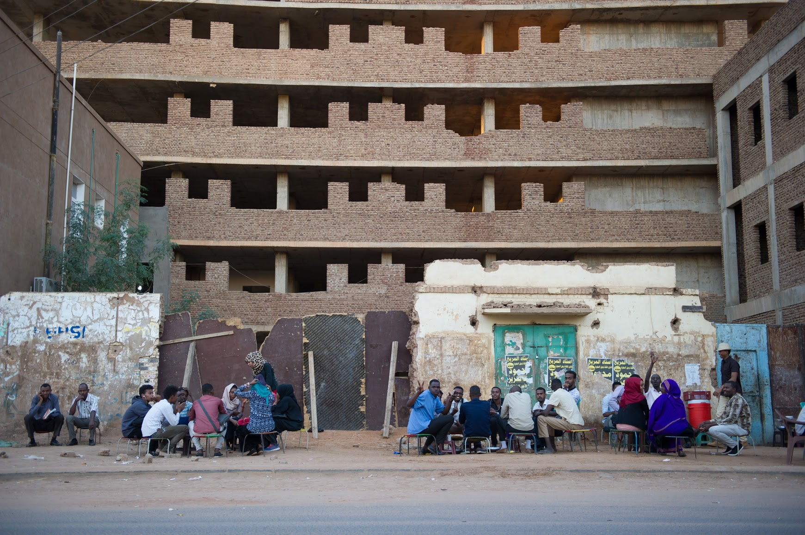

*Ba'aka mother and baby from CAR (2014)*

This photo is on a few Wikipedia pages: 
- [Aka people](https://en.wikipedia.org/wiki/Aka_people)
- [African Pygmies](https://en.wikipedia.org/wiki/African_Pygmies)
- [People by ethnicity](https://commons.wikimedia.org/wiki/People_by_ethnicity)

*Street scene from Khartoum, Sudan (2016)*

## Photos

Soon

## Travel

I've been to about 70/196 countries. My favorite trips have been:

- 2014: Republic of Congo and CAR: CAR has the best elephant viewing in the world and is always an adventure
- 2015: Rwanda and DRC: A loop around Lake Kivu including Virunga, Idjwi Island, Kahuzi-Biega, Nyungwe, Volcanoes, and some hiking/cycling along the lake on the Rwanda side
- 2016: Tour d'Afrique: 4-month bike ride from Cairo to Cape Town
- 2016: Gabon: Awesome elephant viewing including elephants near the beach
- 2017: USA/Canada roadtrip: 2.5 months in a loop from Chicago to the south to California, up to Canada, down to Utah, then back to Chicago
- 2017: The Israel Trail: 1.5 months hiking through the whole country from north to south 
- 2018: India and Nepal: India is a crazy place and Nepal is beautiful -- I hiked the Annapurna Circuit
- 2018: Living in Paris for 2 months: J'ai habité à Belleville et j'ai essayé d'apprendre le français (which didn't go that well because I had to Google Translate this)
- 2021: Living at Sangha Lodge in CAR for 2 months: An interesting alternative to living in a city during a pandemic 