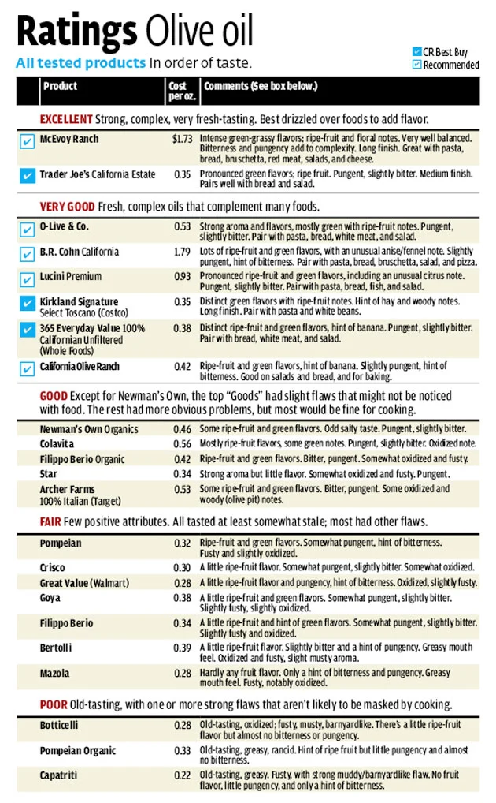

## Eating Habits
Mark Zuckerberg and Steve Jobs (and apparently also Elizabeth Holmes) are/were known for minimizing decisions and making things simple by wearing the same thing everyday. I find that this is also a good technique with food, [as do some others](https://www.theatlantic.com/family/archive/2019/03/eating-the-same-thing-lunch-meal/584347/). 

I eat essentially the same breakfast and lunch every day and have a couple of dinner variation options. The breakfast part probably doesn't seem that strange. The "it makes sense to eat the same thing every day" agreement metric probably gradually declines as we get to lunch and dinner. 

And then you may be thinking well if you're going to eat the same thing every day, you should at least enjoy the cooking aspect and experiment with different sauces and spices and things. I agree that having a few small variations is fine, but in general prefer to minimize thinking about these things on a day to day basis. 

I've already given the clothes analogy above, which I don't participate in, because I think picking clothes is a very low effort and kind of fun activity, although admit that buying them and thinking about which ones to take with on trips can be time consuming. 

Two more analogies for things where I prefer to take the decision-minimization approach:  
1. Picking stocks 
2. Working out -- It's hard enough to calculate [how many days there are in a week](https://gawker.com/bodybuilders-try-fail-to-calculate-number-of-days-in-1677545788), so I like to just follow pre-made programs or go to classes

## Automate the Food Principles
[1. Eat nearly the same thing every day](#1-eat-nearly-the-same-thing-every-day) 
[2. Avoid manual labor and guesswork as much as possible](#2-avoid-manual-labor-and-guesswork-as-much-as-possible) 
[3. Simplify the supplies](#3-simplify-the-supplies) 
[4. Get food delivered or figure out your supermarket routine](#4-get-food-delivered-or-figure-out-your-supermarket-routine) 
[5. What about the content of the food](#5-what-about-the-content-of-the-food) 
[6. My daily food](#6-my-daily-food) 

### 1. Eat nearly the same thing every day
Eating the same thing for the main meals is surprisingly not very boring and is highly recommended. Maybe do some small variations with snacks and certain meal elements (dinner makes the most sense to make into a fun activity or an out-of-home event), but keep the same structure every day! Picking/cooking your foods is also the best way to ensure that you get the best quality.

### 2. Avoid manual labor and guesswork as much as possible
Before I discovered the hard boiled egg machine, I never knew what I was doing. I'd forget about the eggs more often than not and even when I remembered and timed them fairly well, I frequently had peeling issues. Here is a list of my favorite tools and streamlining ideas: 

**[Hard boiled egg cooker and vegetable steamer](https://www.amazon.com/DEC012BK-Electric-Scrambled-Vegetables-Dumplings/dp/B00ZGCKLE2):** With this hard boiled egg cooker, you put eggs into little slots, fill up a measuring cup to the right level, put the water in, and flip the switch. No waiting for water to boil or forgetting how much time the eggs need to cook for since the machine buzzes very loudly when it's finished. I cook 12 at a time every few days in the mornings for use in salads. Vegetables can be steamed in the same device! It can fit about 8 oz of most types of vegetables and takes 10ish minutes to steam. Again, just adding a bit of water, loading in the vegetables, and turning it on. 

**Indoor grill:** Though this is a bit of a compromise at dinner, I am very happy with the chicken breasts produced for breakfast/lunch. I think there's essentially no easier way to cook protein than to plug in a grill, wait a couple minutes, and just drop the item inside and wait a few more minutes. No flipping, no oil splashing all over, and in the case of chicken breasts, no serious timing issues since slightly overcooked isn't a big disaster. 

**Scrambled eggs:** My biggest efficiency improvement here has been not pre-stirring the eggs in a separate glass or container. Just drop them into the oil in the pan and stir with the spatula! Then keep stirring on a low-medium temperature. 

**Vegetable chopper:** Figure out your tomato/cucumber/pepper/onion ratio and get this [pro vegetable chopper](https://www.amazon.com/Chopper-Vegetable-Mueller-Vegetable-Fruit-Cheese-Onion-Chopper-Dicer-Kitchen/dp/B01HC7BNJA). Vegetables still have to be cut into smaller slices, but this does the hard work to get them into salad-appropriate sized pieces.  

**A good nonstick pan:** I get sad every time I see a sticky pan. The pain is not worth it! I recently got the [Made-In Non Stick Frying Pan](https://madeincookware.com/products/non-stick-frying-pan), which has been great. Wirecutter has some good value alternatives [here](https://thewirecutter.com/reviews/best-nonstick-pan/) too. 

**Cook in bulk:** I only do this for foods that I don't mind eating cold, which are currently Israeli salad and hard boiled eggs. The time to cook a chicken breast on an indoor grill is so low and the value from eating it hot off the grill is so high, that I don't think it's worth bulk cooking and reheating an item like this. 

**The oven:** I only use this for dinner and don't have any great tips except for lining the pan with foil to make cleanup easier. Also small countertop toaster ovens seem extremely effective for small portions (like a full meal for one or just meat/fish for 2-4). 

### 3. Simplify the supplies
**Keep bulk stocks:** Minimize supermarket trips and running-out-of-things catastrophes by keeping stocks strong

**One oil:** I use one extra virgin olive oil for everything from cooking eggs to salmon to putting on salads. I try to avoid European ones due to [shadiness](https://www.forbes.com/sites/ceciliarodriguez/2016/02/10/the-olive-oil-scam-if-80-is-fake-why-do-you-keep-buying-it/#56896ffe639d), so stick with either Israeli or Californian oils (because these are most accessible in places I've lived). Trader Joe's and Whole Foods have their own brands with California olives that are both rated very well by Consumer Reports (though the review is from 2012). 

**Use frozen vegetables:** Frozen vegetables are generally cheaper than fresh and never worrying about expiration is amazing. Freeze in those nutrients! 

**Kosher:** Meat or dairy, pick one. Literally all of the complication from having a kosher kitchen comes from separating meat and dairy. If you go the meat route and you insist on dairy, uncooked things like candy or chocolate bars are still pretty easy to keep around since they don't use dishes or cooking instruments. 

**Use frozen meat/fish:** The best quality meat and fish that I've found have to be ordered in the mail and come frozen already. I have most recently been getting chicken breasts from [KOL Foods](https://www.kolfoods.com/) (Kosher/organic/pastured) and salmon from [Tanner's Alaskan Seafood](https://www.tannersfish.com/) (wild-caught). Always having something in the freezer is easy to manage -- just put in the fridge 1-2 days before you need it. No need to go to the supermarket so often or to risk food going bad in the fridge. 

**Strong tupperware:** For transporting/storing food, I like the plastic Snapware set recommended on [The Wirecutter](https://thewirecutter.com/reviews/best-food-storage-containers/). I don't like unnecessarily dealing with glass and my biggest concern is the lids not opening -- these seem very secure. 

**Organic decisions:** I'm not sure how beneficial organic is. There is the [Dirty Dozen](https://www.produceretailer.com/article/news-article/2019-dirty-dozen-and-clean-15-lists-released) list that suggests that these are the dirtiest wrt pesticides, so we should strictly buy these organic. 

My rule is to buy organic when possible, especially for eggs/meat/protein. For other things, I usually get organic, but sometimes don't if the price differential is very large (approx. more than 25% of the non-organic). Maybe I should just get everything organic to simplify the decision-effort. 

### 4. Get food delivered or figure out your supermarket routine
I generally have enjoyed going to supermarkets. It's the first thing I like to do when visiting a new place/city and the feeling of wide aisles and picking your own produce and wandering around finding new things can be fun. If I had easy access to a quality/good value supermarket and/or farmer's market, I'd probably prefer to go there 1-2 times/week. In NYC, I primarily used Amazon's PrimeNow for Whole Foods deliveries, which has been a pretty mediocre experience overall, but is free for same/next day 2-hour delivery windows and is ridiculously easy to use and when issues come up, their support has been very quick and generous.

### 5. What about the content of the food?
I find it very easy to have willpower in situations where food doesn't yet belong to me (in supermarkets or when ordering from them online) and very difficult to have willpower when unhealthy foods are available for immediate eating in my surroundings. I find it nice to keep the base state under control so that when less healthy situations arise (restaurants, parties, random occurrences of low-percentage chocolate nearby), they can be enjoyed without concern. I've also found that I feel better when eating healthier. (I think of healthy as mostly Paleo, i.e., mostly proteins/nuts/seeds/vegetables/olive oil, with some fruit and 85%+ chocolate, and mostly avoiding processed foods. I like this strictish definition because it means there's little guessing about whether an item is in the program or out of the program, but of course this is just one interpretation and maybe I'm (slightly) suffering for naught.) 

Shoutout to Simon of [Minmax Meals](https://www.minmaxmeals.com/) for creating great value bulk-cookable meals on a site with an excellent name. 

### 6. My Daily Food

**Breakfast**
- 3 scrambled eggs: Cooked in olive oil with raw sunflower seeds added after plating. I am strongly against getting brown in the eggs (like every hotel omelette station ever).
- 4 oz chicken breast: Cooked on an indoor grill with nothing added
- Israeli salad: Chopped up tomatoes/cucumbers/peppers and potentially onions. Important to use yellow or orange peppers so they don't get confused for tomatoes (red) or taste terrible (green). Top with olive oil. 
- 1/2 avocado: Great fat source, but difficult to deal with the erratic quality differences and ripeness issues! 
- Total cooking/prep time is about 5 minutes (assuming the salad can be taken from a pre-made bulk container)

**Lunch**
- 3 hard boiled eggs: Cooked in bulk and eaten cold. I enjoy pre-eating the whites and sprinkling the yolks into the salad [Salt Bae](https://en.wikipedia.org/wiki/Salt_Bae) style.
- 4 oz chicken breast: If taking lunch to go, cook this with the morning breast
- 1/2 salad bag: Ready to eat salad bags, usually some kind of Romaine mix
- 1/2 avocado: 2nd half from breakfast
- Vegetables: If at home, I always steam about half a bag of frozen vegetables (usually broccoli, sometimes a mix). This can be done during the breakfast cooking if taking lunch to go, but tends to not taste great cold. Israeli salad is a good alternative. 
- Total cooking/prep time is about 10 minutes with the vegetables being the limiting factor
- If eating at the office, keep a bottle of olive oil on site so you don't have to commute with the risk of an olive oil explosion 
- I find it very efficient to eat this with hands, but that should definitely not be done in public and probably not even admitted in a public blog space

**Dinner**
- 8 oz salmon fillet (occasionally alternative meat/fish). Salmon broiled in the oven is a great option, but I've also sometimes been using the grill in cases of laziness. 
- Vegetables: Steam half a bag of frozen vegetables
- Rice: I eat rice on Friday nights and occasionally on other days. I hate the cleanup value of cooking rice in a pot. Alternatives are microwaveable bags, boilable bags, and rice cookers. I think the ease of microwaveable makes that my favorite current option for efficiency, while the rice cooker is probably the best quality. 
- Total cooking/prep time is about 10 minutes, longer if including oven heat-up time 

**Snacks that I like**
- Nuts: I like raw almonds and Brazil nuts. I try to avoid the carb-heavy ones like cashews since almonds are better anyway. 
- Carrots: My addiction. I think these are the perfect snack. Maybe too perfect. I can only stop when I see my face turning orange. 
- 85%+ dark chocolate: Apparently the minimum acceptable level health-wise, which makes sense because it has about the minimum level of taste-acceptability as well. I did an overly complicated computation that concluded that I should eat this only when avocado is not available. 
- Green tea. Does this count as a snack?
- Good fruit (berries): Good snack/dessert option/carrot alternative. I usually get when on sale. 
- Less good fruit (apples, bananas, grapes, oranges): Good for post-workout situations
- Soup/bone broth: Low experience with this, but supposed to be excellent

**Other stuff** 
I've been using za'atar as the only seasoning. I should probably get some salt and pepper. I mostly drink only water, with occasional green tea, and even more occasional alcohol and matcha tea. 

Slightly neurotic list of my food goals: Try to get everything organic, eggs pastured, meat Kosher, fish wild, EVOO only from California or Israel, and prefer local over distant. 

I've considered intermittent fasting and Keto. Keto is definitely intriguing, but I've seen mixed reviews and it is very challenging to stick to, even if I ate only vegetables as my carb source. I like the idea of applying intermittent fasting when it comes up naturally. Like when traveling with little access to reasonable food or when a dinner or breakfast meal is randomly skipped. It seems like a 16-hour fast window and 8-hour eating window is pretty optimal. I also like the idea of fasting on [Jewish fast days](https://www.chabad.org/library/article_cdo/aid/609607/jewish/Jewish-Fast-Days.htm) not really for religious reasons, but just as a way to force occasional fasts (and it can't hurt to think about the religious significance as well). 

**What about restaurants?** 
I went through a phase of being into restaurants, but now find that I prefer the norm to be eating a high quality meal at home, and to let randomness dictate when restaurants happen. I think for most people, this will happen plenty (family/friend events, celebration meals, meals when traveling, etc.). 

