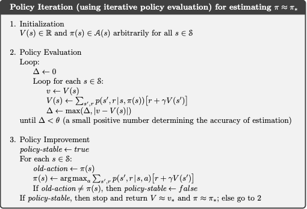
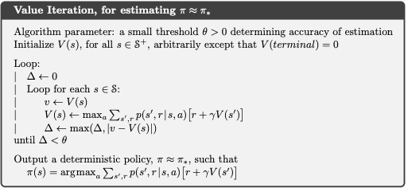
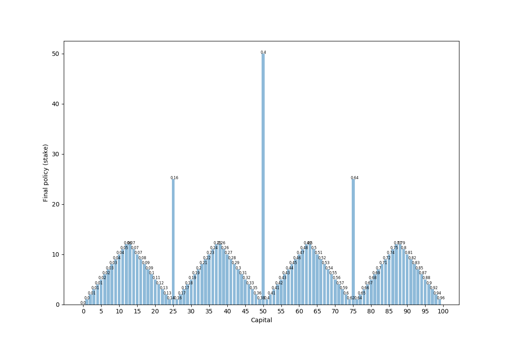
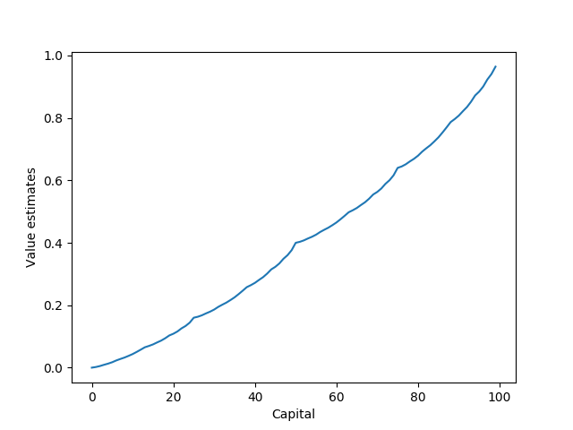
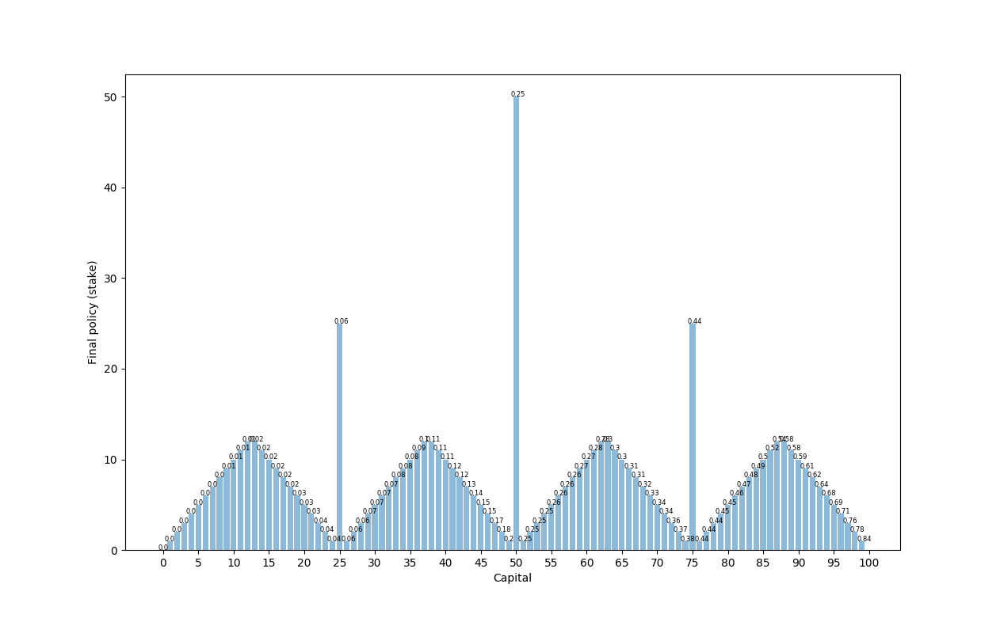
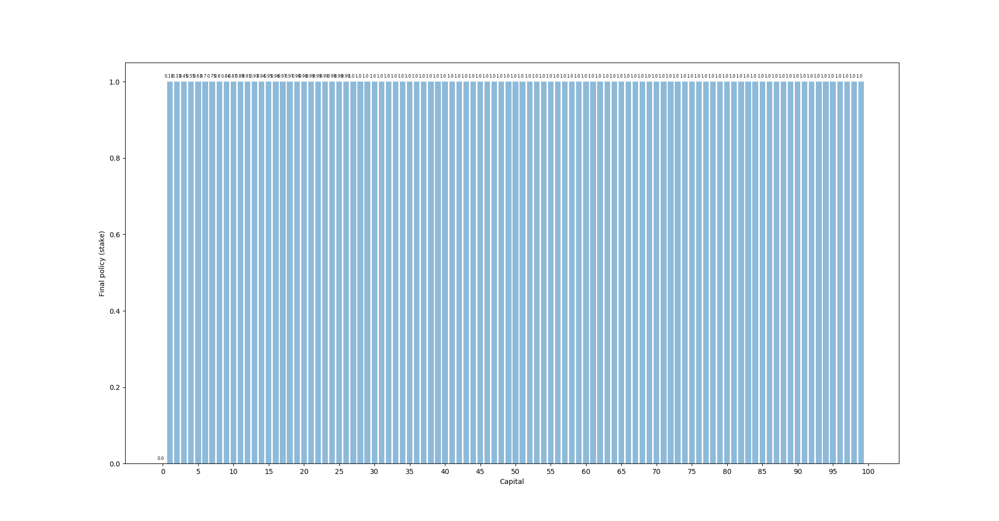

## The Gambler Problem
We are going to illustrate value iteration and policy iteration with the Gambler Problem from the Reinforcement Learning book by Sutton and Barto. These are dynamic programming algorithms, which are algorithms that can be used to compute optimal policies given a perfect model of the environment as a Markov decision process (MDP). 

The gambling event is to bet on coin outcomes such that heads is a winning wager and tails is losing. The probability of heads is selected as a parameter and the gambler's goal is to get to a score of 100. Getting to 0 is a loss. The gambler can have current states from 1, 2, ..., 99 (i.e., the amount of money he has). 

Bets can be made up to the amount of money that the gambler has, but not an amount that would bring the total to over 100 in the event of a winning bet. 

For example, if the gambler has 60, the maximum bet is 40 because anything over 40 would result in a score of over 100 with a win. 

So we have betting options of 0, 1, ..., min(s, 100-s), where the state s is from 1 to 99. 

The reward is given as +1 for reaching 100 and otherwise 0. 

We will use value iteration and policy iteration to find the optimal policy and game value at each state. 

## Policy Iteration

 From Reinforcement Learning by Sutton and Barton

## Value Iteration

 From Reinforcement Learning by Sutton and Barton

We initialize a state value V(s) and policy pi(s) for each state as zeros. Then we iterate through each state from 1 to 99. In each iteration, we set v as the value of that state, determine the range of possible actions, and set val_action as zeros for each possible action. 

Then we loop through each possible action and evaluate its value using the Bellman equation. 

The Bellman equation effectively calculates the value of an action at a state by computing the expected value of the immediate return from the action and (in the case of 1-step lookahead) the currently known value of the resulting state. 

We set the value of the state as the maximum of all of the action values. 

This value iteration over every state keeps running until the maximum change of the state value over all states is less than a preset epsilon. To do this, we initialize a delta value as 0 and update the delta after each state iteration to be the maximum of the previous delta or the absolute value of the change in that state value. 

Once we finish an iteration of all state values and delta is less than the epsilon value, we assume that we have found the state values and then find the optimal policy given these state values. 

This is a single for-loop over every state from 1 to 99 in which we calculate the action value with the Bellman equation for each action for each state and then set the best action as the action that results in the highest value. We set this as the policy for that state. 

## Graphical Results
 
 p_h = 0.4
 Here we see the final policy (how much to bet) on the y-axis and the current capital state on the x-axis. Above each policy is the value of being in that state (which is a bit hard to see). We see that this has this strange looking format with a few pyramid shapes and larger "all-in" spikes at 25, 50, and 75. Betting large when the odds are against us makes sense in order to play with maximum variance -- if we instead bet small, then we would see much lower variance and therefore a lower chance of reaching 100. (Imagine we are at state 50 -- if we bet all 50, we have a 0.4 chance of winning. If we bet 1, we would need to win 50 times in a row, which is 0.4^50 ~= 0.)

 
 p_h = 0.4
 This is a graph of the final value of being in each state

 p_h = 0.25
  Here we see the same format as when p_h = 0.4, but the value of being at each state is lower because the probability of winning the bet is lower. 

 
 p_h = 0.55
 Once p_h goes above 0.5, the final policy turns into simply betting 1 at every state (we do not use discounting). This is because the odds are now actually in our favor, so we prefer to keep variance as low as possible. 

## Code

