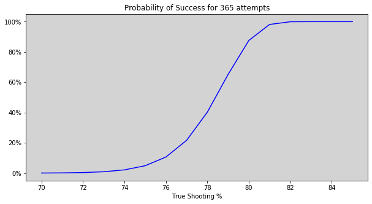
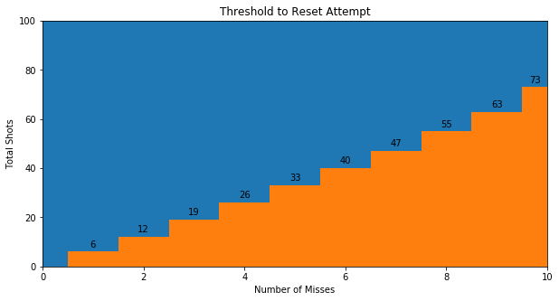

## The Bet
[Mike McDonald](https://twitter.com/MikeMcDonald89) is a successful gambler/poker player who set up a bet with the [following terms](https://twitter.com/MikeMcDonald89/status/1246917870677680129):

Main terms: 
- I must sink 90/100 free throws on an attempt. I get unlimited attempts.
- Regulation ball, regulation hoop, lane violations not allowed
- Even money
- Bet lasts until end of 2020

Detailed additions: 
- I must define when an attempt starts. I.e. if I shot 150 times and scored 90/100 between attempts 20-119 I'd need to reset counter after 19 for it to count.
- If I have no safe access to a regulation hoop I get an extension until I have had 50 hours of safe use of a regulation hoop

The short version is that Mike has to get 90/100 freethrows by the end of 2020 with unlimited attempts and unlimited time per attempt, but each attempt has to be declared. 

## Assumptions
It seems that the "hot hand" theory of improving chances of making a basket on a "hot streak" is pretty unclear ([Wikipedia article](https://en.wikipedia.org/wiki/Hot_hand)) and also would make the analysis much more complicated, so we assume a fixed probability of making each shot. 

There are two main elements that go into the bet: Skill level and reset strategy. The skill level is defined as the proability of making each shot. The reset strategy is when to start a fresh 100 shot attempt. We suggest that if the probability of success from any point is worse than the probability of success from the starting point, then it's best to reset. 

[NOTE: shouldn't we have some threshold here to account for time, so prob. success if very close to end is better than same prob. success at beginning?]

## Probability of making 90/100
If we assume a fixed probability of making each shot equal to $$p$$, then the probability of making at least 90 out of 100 shots is a binomially distributed random variable, with probability of success equal to: $$\sum_{i=90}^{100} {100 \choose i} * p^i*q^{100-i}$$; where $$q$$ is the probability of a miss = $$1 - p$$.

We can evaluate the probability of success by plugging in various values for true shooting percentage ($p$ in the equation above). 
The graph below demonstrates the impact that true shooting percentage has on probablity of success:

We can see that a shooter of around 70% or below is quite unlikely to ever hit 90 out of 100. Using $p$ = 70% results in a probability of 1 in 642,853, which clearly is an unrealistic number of attempts in a one year period.

How, then, can we determine a true shooting percentage that is likely to be successful? If $$x$$ equals the probability of success on one attempt (equal to the equation above), then $$(1-x)$$ is the probablity of failure on one attempt and $(1-x)^n$ is the probability of failure on all n attempts, then $$1-(1-x)^n$$ is the probability of at least one success over $n$ attempts. 

For simplicity, let's assume one attempt per day and again examine the probability of success for various true shooting percentages:

We can see that somewhere between 78% and 79% has a 50% probability of achieving success if they make 1 attempt per day. Anyone with a true shooting percentage in the low 70's would have a marginal probability of success, and below 70% it is quite unlikely to ever make 90 out of 100 free throws. Anyone that shoots 80% or above is almost guaranteed to be successful after 365 attempts. 

## When to reset attempts? Method 1: Binomial
Since anyone outside of high 70's is either almost guaranteed to fail (if below) or succeed (if above) then the question of whether he will be successful really is only interesting if his true shooting percentage falls somewhere in that range. Let's assume a true shooting percentage of 78%, which has a 40% probability of success over 365 attempts. At what point should Mike reset his attempt back to 0 if he has missed a few shots? Obviously if he misses the first shot he should reset, and probably even if he misses the second or third shot, but what about the seventh shot? What if he is 35 of 40? 

One strategy is to compute the probability of success at that point in time, and reset if it is lower than his probability of success at the start of an attempt. A 78% true shooter has a 0.14% (or 1 in 709) chance of making at least 90 out of 100 free throws. If after taking $x$ shots, he has $y$ misses, his probability of success is: $$\sum_{i=90-x+y}^{100-x} {100-x \choose i} * 0.78^i*0.22^{100-i-x}$$

We can find the decision boundary by finding the maximum number of attempts for given number of misses $y$ = 1 through 10 such that the probability of success is lower at that state than the probability of success at the beginning of an attempt:

The datapoint 8 misses, 55 total attempts means that if his 8th miss was after 55 or fewer total shots, he should reset the attempt because his probability of success is lower than at the beginning of an attempt.

### Issues with Binomial Analysis
In reality, a person does not have a fixed true shooting percentage. The probability of making a shot will vary day by day and even throughout an attempt. A more accurate model would treat true shooting percentage as a random variable rather than a fixed quantity. Since success is a tail event (in the situation where the true shooting percentage is in the high 70's), added variance around true shooting percentage will make the probability of success more likely. Additionally, there is debate around whether there is autocorrelation between attempts, which would also add variance.

Also, the strategy above does not take into account time. He likely would accept a slightly lower probability of success at states that already have a high number of shots taken. This would increase the total number of shots threshold for a given miss value.

## When to reset attempts? Method 2: Reinforcement Learning
We can analyze the reset attempt problem using reinforcement learning value iteration. Here's how that works. 

Initial definitions: 
- We define a state as a pair [shots made, shots missed]
- You can think of this as a table with shots missed on the x-axis and shots made on the y-axis
- Shots missed goes from 0 to 10
- Shots made goes from 0 to 90
- We define each pair to have a reward of 0 except for every combination where shots made = 90, so [90, 3] and [90, 5] and [90, 10], etc. all have a reward value of 100 (chosen arbitrarily)
- We define 2 possible actions at each state: shoot or reset. These represent the actions of the player in the bet. 

Value iteration: 
- We cycle through every combination of [shots made, shots missed] 

[NOTE: do policy evaluation?]

## Binomial vs. RL and Conclusions