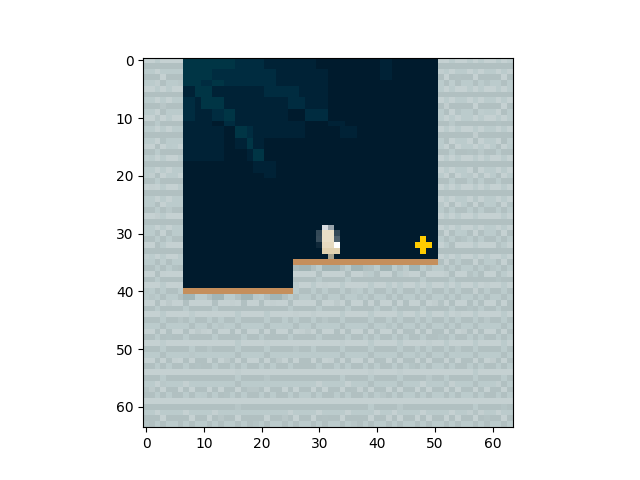
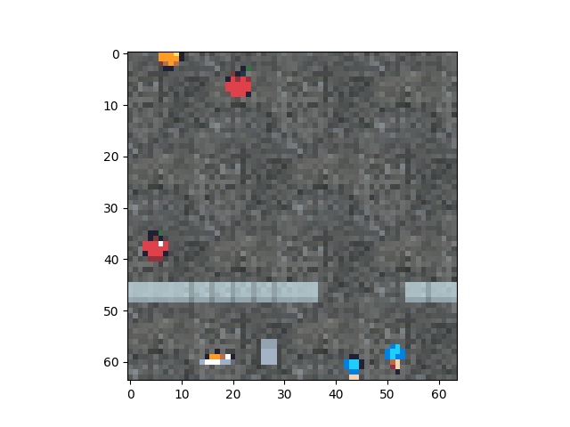
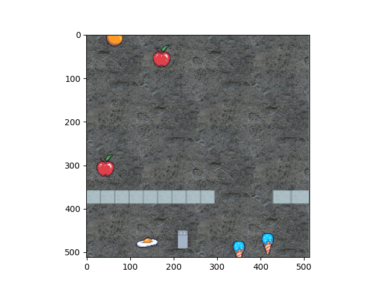
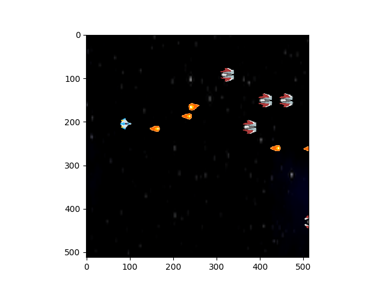
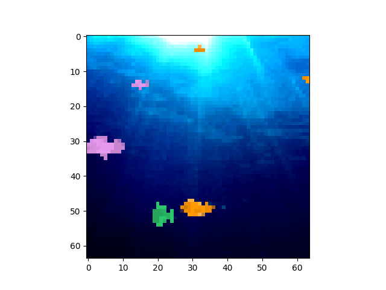
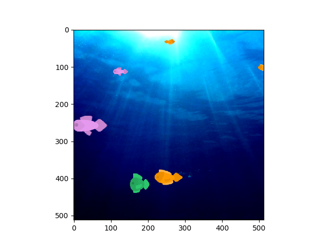
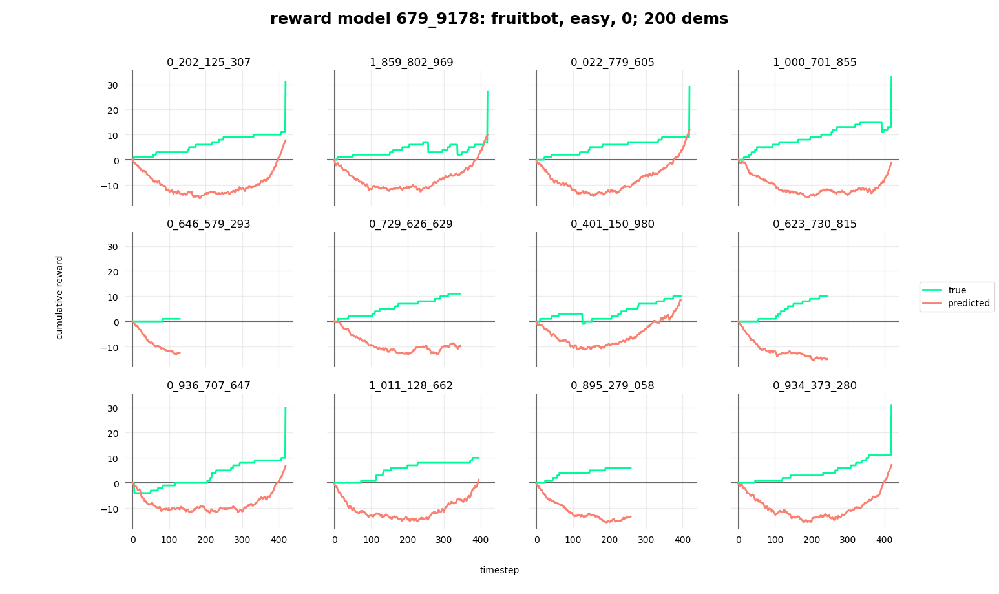

**Contents**
* TOC
{:toc}

## Our Background
We were a team in the virtual 2020 [AI Safety Camp](https://aisafety.camp/), an annual camp that brings together early career researchers to collaborate on research proposals related to AI Safety, first working together online, and then normally meeting up in-person for a 10-day intensive camp. 

Anton Makiievskyi

Liang Zhou 

Max Chiswick

## Introduction
Our work is about assesssing generalization in reward learning. Reward learning as a research direction has recently seen a surge of interest, but like other approaches in reinforcement learning, it may suffer from an inability to generalize from the training environment. Our primary goal is to determine whether existing methods in reward learning generalize well. 

In order to test generalization, we run experiments using the procedurally generated levels from the [Procgen Benchmark](https://openai.com/blog/procgen-benchmark/) environments. The main idea here is that many reinforcement learning experiments were previously performed on Atari games, which always repeat the same levels in the same order, so it is possible that agents have been memorizing the levels after significant training, rather than actually learning how to play the games. The Procgen results by Cobbe et al. (details below) show that training reinforcement learning agents on many (i.e. the more the better) unique training levels would significantly improve test performance on unseen levels. 

We combine work in reward learning and work in procedurally generated game levels to evaluate the generalization capabilities of reward learning. 

### Procgen environments
The Procgen environments include 16 different games, but we looked primarily at 4:
1. Coinrun: Collect the coin at the end of the level while dodging enemies
2. Fruitbot: Eat fruit and avoid non-fruit like eggs and ice cream
3. Starpilot: Side scrolling shooter game
4. Bigfish: Begin as a small fish and eat other fish to get bigger

Coinrun agent view             |  Coinrun human view
:-------------------------:|:-------------------------:
  |  

Fruitbot agent view             |  Fruitbot human view
:-------------------------:|:-------------------------:
  |  

Starpilot agent view             |  Starpilot human view
:-------------------------:|:-------------------------:
  |  

Bigfish agent view             |  Bigfish human view
:-------------------------:|:-------------------------:
  |  

### What is reward learning? 
In many reinforcement learning applications, reward functions are well-specified. We see this in environments like CartPole, where the goal is to keep a pole upright on a track, and where a reward of +1 is provided for every timestep that the pole stays upright. In a card game like Blackjack, rewards correspond to how much the agent wins or loses each hand. In Atari (as well as in Procgen), rewards are game dependent, but are generally well-specified (usually earning points for defeating enemies and finishing levels and losing points for getting hit or dying). 

However, many tasks do not have such clearly defined rewards, which leads to limitations in the possible applications of reinforcement learning. Inverse reinforcmement learning is capable of extracting a reward function given a demonstrated behavior, but complex tasks can be difficult to demonstrate in practice.

Christiano et. al's Deep Reinforcement Learning from Human Preferences (detailed below) uses the example of performing a backflip. One could attempt to design a reward function that an agent could learn from, but (a) this would be hard to specify and (b) would often end up with unintended results from non-ideal reward design and/or reward hacking, whereby the agent finds a "loophole" in the reward specification. A loophole example is an agent that gets rewarded for cleaning up glass decides that it's optimal to break as many glass objects as possible in order to have more glass to clean and therefore to earn more clean-up rewards. The difficulty in specifying the rewards points towards the issue of human-AI alignment whereby humans want to align AI systems to their intentions and values, but this may not work in practice. 

Designing a reward function for a complex task like performing a backflip is reminiscent of hand-coding features for an application like spam detection. While this could work to some extent, we know that machine learning provides a better solution by automatically detecting messages that have features similar to those that have been previously marked as spam. 

Reward learning involves learning a reward function from human feedback and then optimizing that reward function. This estimated reward function is then used in place of known rewards in reinforcement learning training. The human feedback model by Christiano involves comparing short video clips of different behaviors that the human can rank. These rankings derive the predicted rewards. 

## Initial Exploration
We began our research exploration focused on papers by Christiano, Ibarz, and Cobbe. The first two were impactful in utilizing reward learning alongside deep reinforcement learning and the Cobbe paper introduced the procedurally generated games. 

While working on the literature review, we came across a newer paper by Brown, which proposed a new, simpler reward learning method called T-REX that looked promising and seemed advantageous because it was supposed to be able to learn reward models without querying and feedback. 

## Literature Review
We primarily referenced four papers in our research:

1. [Deep reinforcement learning from human preferences](https://arxiv.org/abs/1706.03741) -- 2017 by Christiano et al.

2. [Reward learning from human preferences and demonstrations in Atari](https://arxiv.org/abs/1811.06521) -- 2018 by Ibarz et al.

3. [Extrapolating Beyond Suboptimal Demonstrations via Inverse Reinforcement Learning from Observations](https://arxiv.org/abs/1904.06387) -- 2019 by Brown et al.

4. [Leveraging Procedural Generation to Benchmark Reinforcement Learning](https://arxiv.org/abs/1912.01588) -- 2019 by Cobbe et al. 

### Deep reinforcement learning from human preferences
TODO: Summary

### Reward learning from human preferences and demonstrations in Atari
TODO: Summary

### Extrapolating Beyond Suboptimal Demonstrations via Inverse Reinforcement Learning from Observations
TODO: Summary

 In addition, their experiments showed that T-REX was able to learn better-than-demonstrator quality agents using only 12 demonstrations and their corresponding preference labels. This was done by extracting shorter snippets from the demonstrations, allowing them to greatly expand the size of their training set at the cost of reduced accuracy of labels. Based on their strong results and simple idea, however, we decided to base our initial implementations on T-REX and attempt to make that work with the Procgen environments from Cobbe+19.

### Leveraging Procedural Generation to Benchmark Reinforcement Learning
TODO: Summary

## Initial Implementations 
It was very convenient that both the Procgen and T-REX code from the papers were available on Github; therefore, we were able to simply clone the relevant repositories (OpenAI Baselines, Procgen, and T-REX) and begin experimenting with the code. Because the T-REX code was meant for interacting with Atari and Mujoco environments, we reimplemented the core features of T-REX to use trajectories from Procgen environments instead. 

Eventually, we were able to build a simple pipeline that formed a crude outline of our project with the following steps: 
1. Train agents with PPO on the Procgen environments, from which we would obtain a series of policy models (trained agents) for each distinct environment
2. These policy models would be run on different procedurally generated levels (training levels) to produce sets of trajectories, which we call demonstrations.
3. These demonstrations would be fed into our T-REX implementation, including a reward learning module, that would produce a trained reward model that could be tested for performance on a totally different set of levels (test levels). 
4. Finally, we made a modification to the PPO learning procedure to use our learned reward models, as opposed to the true reward from the environment.

Because our project would focus on the reward learning part of this pipeline, we thought it wise to establish a common set of demonstrations early on that we could draw from for the different experiments we wanted to try. Therefore, in training the initial agents, we saved model checkpoints over the course of training. This would give us a range of model qualities to choose from when generating demonstrations, allowing us to control the quality of our demonstrations. 

| :exclamation:  Deciding which environments to use  |
|-----------------------------------------|
While Procgen has 16 environments, we knew that we wanted to run at least the initial experiments on a small subset of environments. We played the games as humans to get a feel for them and then decided to choose four games based on the criteria that they are significantly different in terms of gameplay and rewards. We chose the environments (as mentioned above): Coinrun, Fruitbot, Starpilot, and Bigfish. 

For each of the 4 environments, we generated 2000 demonstrations on 2000 distinct levels from a variety of model qualities; each demonstration would be sourced from a checkpoint model picked uniformly at random over the course of training. We designated 1500 as training demos and the other 500 as test demos. Here are some sample demos from two of the games. In both cases, the one on the top is a stronger demo, while the one on the bottom doesn't perform well. 

Coinrun demo #1
<iframe width="500" height="500" src="https://www.youtube.com/embed/KrDAsgg2pjA" frameborder="0" allow="autoplay; encrypted-media" allowfullscreen></iframe>  

Coinrun demo #2
<iframe width="500" height="500" src="https://www.youtube.com/embed/QuiEemW8MS0" frameborder="0" allow="autoplay; encrypted-media" allowfullscreen></iframe> 

Fruitbot demo #1
<iframe width="500" height="500" src="https://www.youtube.com/embed/Fneb5W0YDE0" frameborder="0" allow="autoplay; encrypted-media" allowfullscreen></iframe>

Fruitbot demo #2
<iframe width="500" height="500" src="https://www.youtube.com/embed/lm6VtOyRP50" frameborder="0" allow="autoplay; encrypted-media" allowfullscreen></iframe>

| Deciding what to implement  |
|-----------------------------------------|
In retrospect, while deciding to implement the more advanced T-REX algorithm made sense in many ways given that the code was available and it seemed to be a clear improvement on the prior papers, we believe that there may have been advantages to implementing one of the earlier papers. Some of the questions we thought about when deciding what to implement were:

1. How important is it to implement a paper that is better known (either in terms of citations or author/group)?
2. What are the pros and cons of implementing the more fundamental algorithm vs. the more advanced algorithm?
3. What are the tradeoffs between writing the code from scratch, using an outdated code implementation, and using an updated code implementation? Could we contribute to an existing Github repository?
4. Which algorithm is easiest to implement to work with new environments?

## Initial Experiments
Now that we had decided on our experimental setup, we had to think about which metrics to use to evaluate our reward model relative to the true rewards of the environment. Our initial plan was to use correlation and accuracy. The correlation (both Pearson and Spearman) between the reward assigned by the model and the true reward; and the accuracy of the model in determining which of two snippets from given trajectories would produce the larger trajectory reward. This definition of accuracy comes from how T-REX works internally, because the training procedure only has access to the entire demonstration reward and doesn’t actually have access to the true snippet reward. --TODO: calculate the accuracy of the entire demonstration, since this is testing anyway.--

Early on, we were informed that researcher Adam Gleave had a working project on the evaluation of reward models, which could serve as a robust replacement for these generic metrics. We corresponded via email, and he was kind enough to send us his working paper as well as his code base. We spent a few days attempting to integrate his method, EPIC, into our pipeline, but were unable to successfully do so. It’s possible that our training objective, which is a regularized variation of the accuracy on a validation set, is simply not good enough.

| :exclamation:  Communicating with paper authors  |
|-----------------------------------------|
Although we were hesitant to email with other researchers, we received unbelievably thorough and thoughtful responses, and were really impressed by how others were very willing to help with suggestions and troubleshooting! 

After some initial experiments intended to get a very simple setup working with a fixed number of demonstrations, we were ready to run more thorough experiments on the demonstrations. We first ran sets of experiments varying the number of training demonstrations given to the T-REX procedure; we tried the range of 9, 12, 15, 20, 50, 100, 200, 500, and 1000 (recall that T-REX used only 12 demonstrations in their paper). 

Each run would choose that many demonstrations uniformly at random from the set of 1500 training demonstrations, and we ran 5 seeds for each number. From these experiments, we expected that runs provided with a larger number of demonstrations would perform better, simply because they had access to a greater number of unique demonstrations and thus should be able to better distinguish small differences in the environment. Furthermore, we expected the runs provided with few numbers of demonstrations to overfit to the demonstrations they were given.

From our comparison metrics (correlation, accuracy), it was clear that our model learned something, though we were disappointed at the actual performance. The correlations were not as clean as we hoped. Despite decent accuracy, we would sometimes obtain a mess of correlations, including highly negative ones. Additionally, some exploratory experiments to try to train new policies using these learned reward models gave very poor results. Therefore, we decided to do more specific experiments to try to tease out the factors contributing to the poor performance of these learned reward models.

---CORRELATION AND ACCURACY PLOTS SHOWING 2 DIFF GAMES AND DEMOS--- (COINRUN, FRUITBOT)

| :exclamation:  Nothing in Deep RL is that easy |
|-----------------------------------------|
From here, we realized the project would be a long one. We took the time to implement better logging of results, a pipeline for running experiments, visualization code for agents and demonstrations, and plotting for reward model predictions.

--DEMOS FROM TRAINING ON REWARD MODEL, COINRUN AND FRUITBOT 1 EACH---

## Reflection
| :exclamation:  Summary of steps we attempted to improve results  |
|-----------------------------------------|

Thing we attempted/plan to attempt             |  How we did it/plan to do it
:-------------------------:|:-------------------------:
Try to emulate the thing that we know worked  |  Test on Atari and modify Procgen to act like Atari with sequential levels
Try to “cheat” to identify areas that may be faulty  |  Use true snippet rewards rather than ranked demonstrations in T-REX
Visualize what’s happening in experiments   |  Generate plots and demonstrations on reward model
Identify oddities that may be harming learning  |  Remove backgrounds, generate lower quality demos that learn negative rewards better
Look for possible errors in code  |  Thorough code checking

One possible reason for the performance we saw is that the reward model simply isn’t able to adapt to procedurally generated environments. In order to be able to compare performance between both normal and procedurally generated environments, we artificially created fixed “sequences” of levels that emulated the provision of sequentially ordered levels, such as seen normally in Atari or Mujoco environments. We don’t have solid results for this yet.

Additionally, we noticed a potentially large and glaring issue upon visualizing how the learned reward models assigned reward across a collection of sample demonstrations. Our reward models would show a signature “U” shape, indicating that it would assign negative reward to the beginning timesteps, and then gradually increase the predicted reward for later timesteps. This indicated that our reward model was barely learning anything about the environment, if at all - instead, the performance could be explained by a heuristic that simply assigned greater reward to later timesteps. However, we’re not completely sure how the model is able to tell whether it’s looking at earlier or later timesteps when it sees test levels; one strong hypothesis is that it makes use of the background, because there are a fixed number of possible backgrounds that are used in Procgen. --TODO: find a way to remove backgrounds altogether?--

One step we tried was to replace the trajectory rewards in T-REX training with the true snippet rewards - this would give the reward learning procedure significantly more accurate inputs to train on, but it would also break the assumption of the only training data being the preferences between demonstrations; in effect, we’re giving the procedure much more complete knowledge that would be inaccessible otherwise. This change enabled us to obtain much better performance on various environments. --TODO: create some plots showing this--

Unfortunately, while giving the procedure true snippet rewards improved the quality of reward learning, there was one issue we noticed that remained unsolved. While plotting cumulative reward predictions versus true reward for fruitbot demonstrations, increases in the true reward would be matched by increases in the predicted reward (as expected). However, fruitbot is unique as the environment that also provides negative rewards when the agent picks up items that aren’t fruit. These negative rewards would not be matched by corresponding negative predictions in our reward model.

Disregarding a possible implementation error, we hypothesized that this could be due to the intrinsic nature of the demonstrations provided to the reward learner: trained agents should learn to avoid areas of negative reward, so there are simply more demonstrations showing the successful avoidance of negative areas (which wouldn’t impact the reward) than there are ones which actually get it. So, the reward model learns that fruits means positive reward while non-fruits mean neutral reward. While attractive, we’re unsatisfied with this explanation because we explicitly include poor-quality demonstrations in our training set, including a fair number of which obtain negative rewards. Even preliminary experiments biasing the training set to include more low-quality demonstrations didn’t help. --There are a couple ways we can tease out what’s going on here, but they take some effort, so this is a TODO.--

One trick we tried early on was to return the absolute value of the predicted reward. While it solved some confusing issues (e.g. very negative correlation), overall there was little justification for it, so we removed it from future runs.

## Further Steps
In the meantime, we’ve also discussed implementing a reward learning pipeline into other environments so that we can easily compare with our Procgen results. Most likely, we will look at Atari, Mujoco, and the Open AI Safety Gym as alternatives. This work is in progress.

We’re no longer certain that continuing with T-REX will be productive. From looking more carefully at the paper, there’s little indication that the agent learns anything more than to survive for longer periods of time (as discussed previously as our “U” problem), which in their environments is correlated highly with improved reward. This would not work for environments like fruitbot.

Therefore, it is likely worth it for us to implement some of the older papers (Christiano+17, Ibarz+18) and see how results from those papers perform and compare. Unfortunately, functioning code is less available for those papers, meaning that we will likely need to reimplement these methods, which will take a significant chunk of time.
