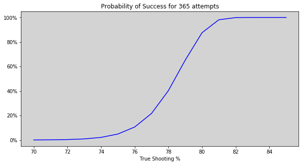

## The Bet 
[Mike McDonald](https://twitter.com/MikeMcDonald89) bet ~$200,000 mostly at even money that he could make 90/100 free throws by the end of 2020 with unlimited attempts. He has to define when an attempt begins and he can "reset" at any time to start fresh at 0 made/0 missed. 

He had one of his first serious attempts today (Aug 19, 2020) and got SUPER close to winning, but ended up with 89/100! 

A friend [Mike Thompson](https://www.linkedin.com/in/mike-thompson-78655b13/) and I wrote a [post](https://chisness.github.io/2020-07-10/freethrow-bet-evaluation) analyzing the math of (a) how likely Mike McDonald is to succeed and (b) what his optimal reset strategy looks like. That post went into some technical details, so we wanted to also make a TLDR/short/clean version so people watching the bet can get a quick overview of the odds and strategy. 

## Success According to Make Percentage
For simplicity, we assume that Mike has a fixed free throw make percentage. Given this, we can compute how often he will succeed with a variety of make percentages. The computation here is actually how often he'll make 90 or more out of 100, but the bet terms are much better than this because attempts that start poorly can be reset early.  

The binomial formula to calculate this is: $$\sum_{i=90}^{100} {100 \choose i} * p^i*q^{100-i}$$; where $$p$$ is the make percentage and $$q$$ is the miss percentage = $$1 - p$$.

We can see that a shooter of around 70% or below is quite unlikely to ever hit 90 out of 100. Using $$p$$ = 70% gives a probability of 1 in 642,853.

Here we plot the probability of success given 365 attempts, which shows that a make percent of about 78 or higher is pretty crucial. Again, the bet is more favorable than shown here because of the option to reset. 

## Success with Simulations
We ran 100,000 Monte Carlo bet simulations for two scenarios assuming a make % of 78. Each of the 100,000 sims goes until the bet is won (i.e., 90 shots are made in an attempt).

The top figure shows the naive strategy of just shooting until winning (making 90) or losing (missing 11). This approach averages about 50 shots per attempt -- still twice as good as having to shoot out the full 100 shots each attempt. 

The second figure is using an optimal reset strategy (detailed in the next section). Here each attempt averages only about 9 shots! This seems very low, but we know that 22% of the time the first shot will miss and will be instantly reset and only about 61% of attempts will make it past 2 shots. 

The most valuable statistic is the average number of shots until winning, which we plotted for each strategy. The strategy with resets takes more trials on average than the strategy without, but the average shots until success is significantly lower. 

<em>Simulations for naive strategy</em>

<em>Simulations for reset strategy</em>

## Reset Strategy
From above we know that if Mike's true free throw make percent is much worse than 78%, his chance of success is not very good. We computed reset strategies for make %s of 78, 80, 82, 84, and 86 below. The y-axis is shots made and the x-axis is shots missed. The reset strategies are represented by the larger font and the approximate value (assuming that winning = 100) of each position is shown with the smaller font. Red areas are resets and purple are continue shooting.  

Full details are in the original post, but in short, this works by setting up a table of every made/missed situation and computing an approximate value of being in each of those situations. Then any spot with value better than the starting position of 0 made/0 missed keeps shooting and any one with value worse than the starting position resets since then it makes more sense to start over. 

It's interesting that for worse make %s, resets come later. For example, with 70 made and 10 missed, this requires 20 in a row and an 86% shooter would of course have a better chance of success than a 78% shooter (about 4.9% vs. 0.7%), but the 86% shooter strategy is to reset and the 78% shooter strategy is to go for it! This implies that the 86% shooter is better off starting over, while the 78% shooter is actually slightly better off to make 20 in a row than to make 90/100. 

During today's (Aug 19, 2020) attempt, Mike had a fixed reset strategy of: 5-1, 11-2, 16-3, 21-4, 27-5, 33-6, 39-7, 46-8,54-9, 73-10, which lines up perfectly with the 82% shooter figure below. 

Reset strategies move pretty linearly with the make percentage, but from the section above, we saw that small differences in the make percentage can be huge, which suggests that working on technique is probably much more valuable than worrying too much about the exact optimal reset strategy. 

Click on the images to enlarge! 

<em>78% make state values and resets</em>

<em>80% make state values and resets</em>

<em>82% make state values and resets</em>

<em>84% make state values and resets</em>

<em>86% make state values and resets</em>
