**Contents**
* TOC
{:toc}

## Blackjack Rules
The Reinforcement Learning book by Sutton and Barto has a blackjack example in chapter 5 that led to many of the ideas in this post.


The rules of the game directly from the book are below:
"The object of the popular casino card game of blackjack is to obtain cards the sum of whose numerical values is as great as possible without exceeding 21. All face cards count as 10, and an ace can count either as 1 or as 11. We consider the version in which each player competes independently against the dealer. The game begins with two cards dealt to both dealer and player. One of the dealer’s cards is face up and the other is face down. If the player has 21 immediately (an ace and a 10-card), it is called a natural. He then wins unless the dealer also has a natural, in which case the game is a draw. If the player does not have a natural, then he can request additional cards, one by one (hits), until he either stops (sticks) or exceeds 21 (goes bust). If he goes bust, he loses; if he sticks, then it becomes the dealer’s turn. The dealer hits or sticks according to a fixed strategy without choice: he sticks on any sum of 17 or greater, and hits otherwise. If the dealer goes bust, then the player wins; otherwise, the outcome—win, lose, or draw—is determined by whose final sum is closer to 21."

## Monte Carlo Basics
Monte Carlo methods use actual or simulated experience to sample returns from an environment. If we had five slot machines, we could pull the lever on each one a million times, average the results, and have a predicted return for each. We don't need to know anything about the internal workings of the machines -- we can learn from the experience. As we take more and more samples, the average should converge to the expected value. 

Blackjack is a good domain for using Monte Carlo reinforcement learning because we can easily generate sample hands while not needing to compute any probabilities. Sutton and Barto give an example of a player having a total of 14 and choosing to stick. Instead of needing to perform various calculations like the chance of winning that hand given the dealer's particular upcard, we can just simulate a single result and know that after enough simulations, we will approximate the true values. 

## Monte Carlo Blackjack
Each hand in blackjack is considered an episode with rewards of +1 for winning, -1 for losing, and 0 for drawing. 

The player's actions are to hit or stick. 

A state in the game is defined as: [player card sum, dealer card showing, whether there is a usable Ace in the player's hand]

A usable Ace means that the player has an Ace that can be used as 11 without going bust. These are called "soft" hands. For example, a hand of Ace-6 means that the Ace can be used as 11 for a total of 17 (it can also always be used as 1 for a total of 6). This is called soft 17. If you hit and the next card was a 4, you would use the Ace as 11 and have the 6 and 4 for 21. If you got an 8, you'd use the Ace as 1 and have the 6 and 8 for a hard 15, and then would have the option to hit or stick. 

There are a total of 200 possible states: (12-21) for the player card sum, (Ace-10) for the dealer card showing, and (0 or 1) for holding a usable Ace (10 * 10 * 2 = 200). 

An example state is: [15, 7, 0], meaning that we have a total of 15, the dealer is showing a 7, and we don't have a playable Ace. 

Note that any player card sum under 12 cannot bust, so will always hit and therefore no decision is needed, so we don't include those other ones as a state. Also note that all face cards count as 10 for the dealer, so there are only 10 possibilities even though the deck has 13 types of cards in it. 

Monte Carlo RL in blackjack works by running out single hand samples repeatedly and deriving state-action values from the averages of the returns of each of these runouts. We simulate a large number of blackjack hands and attribute the results of each hand to the states and actions that were taken during the hand. 

For example, if you were dealt 8-2 and the dealer was showing a 7 and you hit and got a Jack, then your total would be 20. If the dealer turned over a Queen, then you would have 20 to the dealer's 17 and win 1 unit on the hand. We would attribute this return of +1 to (a) hitting with a 10 total against the dealer's 7 and (b) sticking with a 20 total against the dealer's 7. 

State 1: [10, 7, 0]
Action 1: Hit

State 2: [20, 7, 0]
Action 2: Stick

For each state-action, we maintain a counter for how many times we've seen that state and a reward sum to count the total rewards earned after passing through this state. Note that all rewards come at the end of the hand so we can simply increment each state that we pass through in a sample with the final hand return for that sample and a counter increment of 1. 

If we won the above hand example, the counters would increment like this: 

State-Action 1 counter: +1
<br>State-Action 1 return: +1

State-Action 2 counter: +1
<br>State-Action 2 return: +1

After many thousands or millions of simulations, we can take the means of each of these state-action returns (i.e. the return divided by the counter) and get an approximate value for taking that action in that state. 

There is a first-visit and every-visit version of Monte Carlo, with the former averaging returns after the first visit to a state and the latter average returns after every visit to a state. In blackjack it's not possible to visit the same state twice in one hand, so we focus only on the simpler first-visit version. 

## Monte Carlo Prediction (Evaluating a fixed policy)
We can use Monte Carlo Prediction to evaluate a fixed blackjack strategy. Let's consider a strategy (as given as an example in the Sutton Barto RL book) that sticks on 20 and 21 and hits on everything else. Note that this strategy is actually quite bad because it (a) doesn't incorporate knowledge of the dealer's hand and (b) hitting on 17/18/19 is not really a good idea! 

In this case, we would maintain counters for only the states, since the actions are pre-defined by the fixed policy. 

```python
def play_action(self, blackjack_state):
	#we don't actually need the state here for this policy! 
	return STICK if player_sum >= 20 else HIT
```

We run this for 10,000 episodes and produce the following state-value functions: 

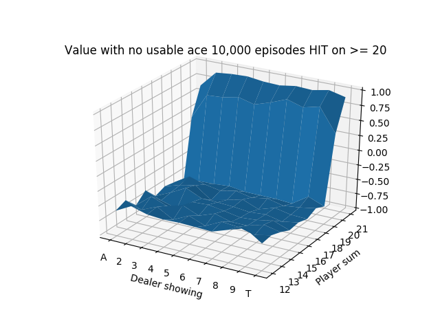


The usable Ace figure after only 10,000 episodes is noticeably unstable because the states with usable Aces are relatively less common, so they haven't been able to stabilize after so few simulations. 

We do a longer run for 500,000 episodes and produce the following state-value functions: 


We see that the values are quite low until the player sum reaches 20 and 21, which is when the strategy is to always stick. Sticking with 20 or 21 is a very good situation so results in high expected value. The entire left side of the figure has a tilt downwards because that is when the dealer is showing an Ace, which is the strongest card since it's least likely to go bust with an Ace. It also means that if the dealer's other card is a 10-value card, the dealer would have 21. 

Finally, we notice that the entire value function tilts downwards as the player sum increases, until 20 and 21 when it goes way up. This is because it's actually generally a good strategy to hit on hands like 12 or 13 where the risk of busting is low, but hitting on hands like 18 or 19 is awful! 19 is a very strong hand and hitting has a small chance of making it slightly better with a 2 or Ace and a large chance of busting with any other cards. 

We look at the value of the particular state of having 17 against various dealer upcards with a strategy of always hitting as above until getting to 20 vs. a new strategy of always sticking in this state. 

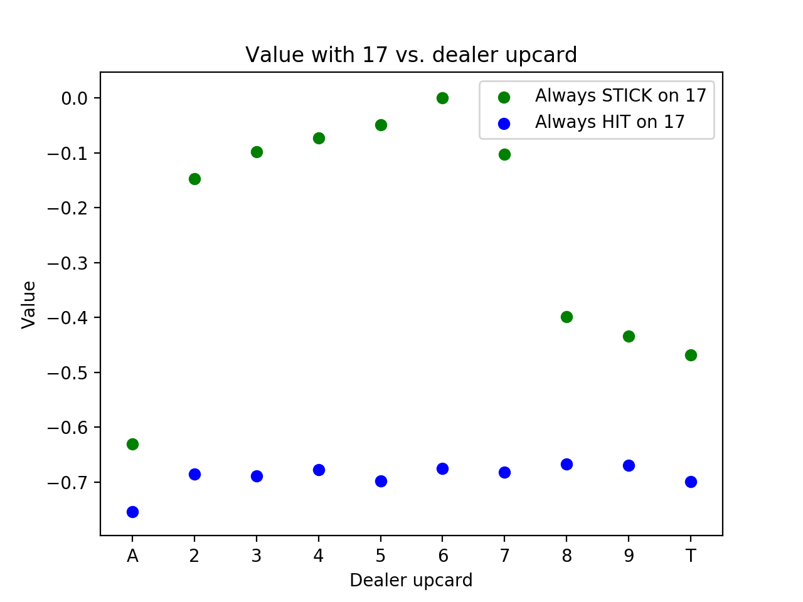

We see that the results of hitting are quite similar regardless of the dealer upcard because the chance of busting is so high. The results for sticking are relatively poor when the dealer has a good upcard (8, 9, Ten, or Ace) and approaching 0 for other upcards. 17 isn't a great hand because neither option produces great results, but the always stick strategy tends to be much better, which is true for all hand totals 17 and higher. 

## Monte Carlo Control (Solving for an optimal policy)
Now instead of setting a fixed strategy, we use Monte Carlo methods to learn the optimal strategy (aka policy). We can use "exploring starts", which in blackjack means simply dealing a random hand to the player and dealer and starting in this random state. If we always started with the dealer being dealt a 5 and the player being dealt 7-2, then we'd quickly learn the optimal strategy for that situation, but that's all we'd know. By simply randomizing the player and dealer cards, we achieve exploring starts. 

We begin with a default strategy of playing randomly, which means that when the only actions are hit and stick, each starts with a probability of 0.5. (We could start with any policy, including the previous one of sticking on 20 and 21 and hitting on everything else.)

How can we use Monte Carlo methods to learn the optimal strategy from here? We run simulations of hands as we did before, but now instead of just incrementing the returns and counters on the states that were passed through, we take an additional step. For each state that we saw in the simulated hand, we look at the estimated value for each action and set the best_action variable to be the action that results in the highest estimated value (we default everything to have a value of 0). Then we modify our policy so that we play that action almost always and play other actions (in this case just one other action) the rest of the time. 

Specifically, we set the strategy for the best action $$P(a_{b}) = 1 - \epsilon + \frac{\epsilon}{num_actions}$$. All other actions are $$P(a_{o})= \frac{\epsilon}{\num_actions}$$. Where $$\epsilon$$ is a small value. If $$\epsilon = 0.1$$ and we had 2 actions, we would play the best action 95% of the time and the other action 5% of the time. This is called soft greedy; greedy would be playing the best estimated action 100% of the time. 

The exploration vs. exploitation concept arises here. We want to mostly play what we currently believe to be the best action, but we don't want to always play it. For example, if we sampled hitting on 19 on the first hand and got a 2 and won, we wouldn't want to conclude that it's always best to hit on 19. It's important to keep exploring alternative actions. This can be refined to decrease $$\epsilon$$ over time when we become more certain of the values, but we keep things simple and used a fixed $$\epsilon$$ here. 

For the simulations, we sample "on-policy", which means we sample hands using the current strategy that keeps improving. After 2 million iterations, we can produce a strategy chart that shows every possible scenario and the optimal strategy, which is simply the estimated best action at each state after running all of the simulations. 

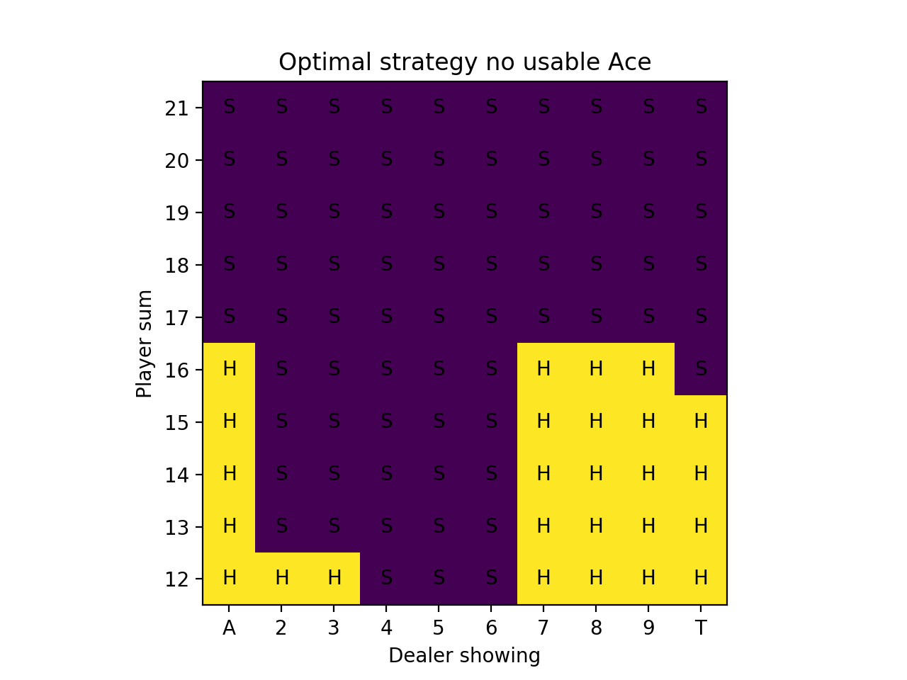
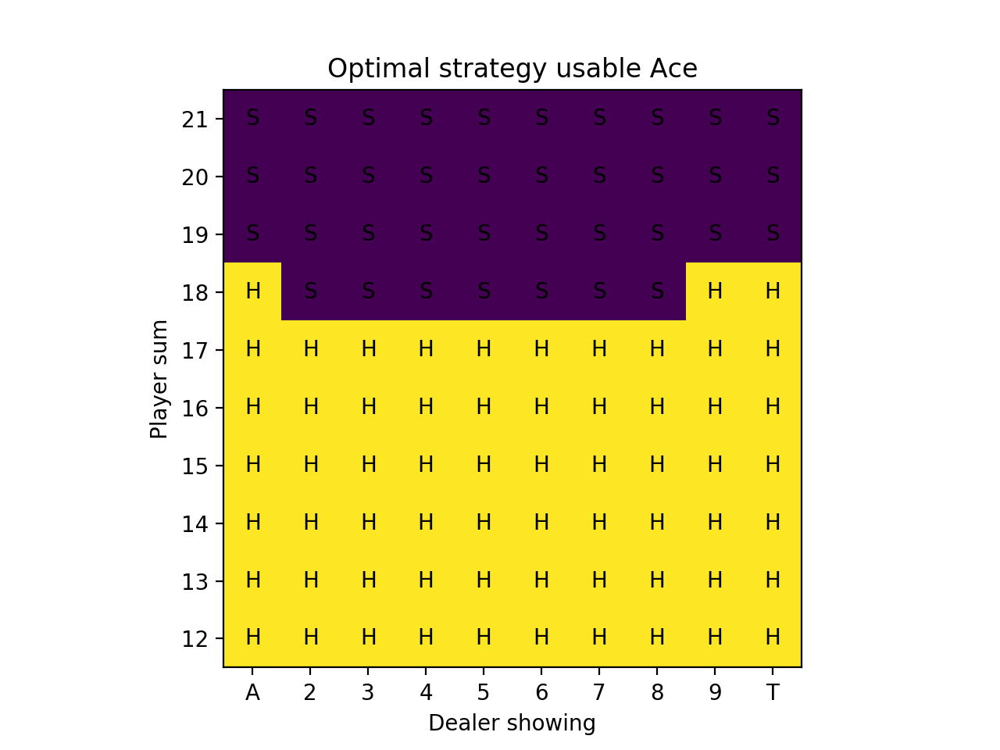

We can also show the value plots as we did before: 

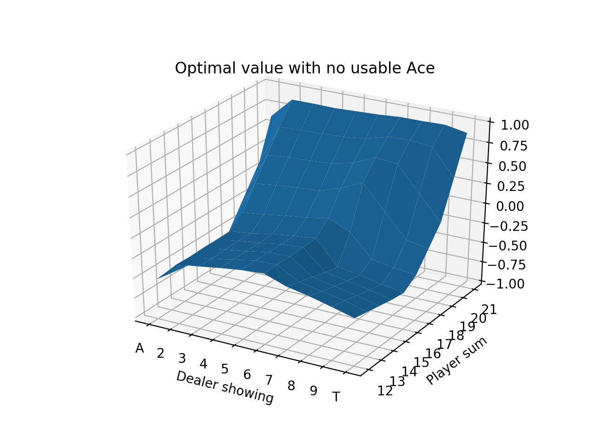


We can compare these figures to those from the [Sutton Barton Reinforcement Learning book](http://www.incompleteideas.net/book/the-book-2nd.html) from chapter 5. 


Our result on the strategy charts is exactly the same except for the case of the player having 16 and the dealer showing a Ten. The book is correct. This is a very marginal spot, which is why the Monte Carlo method was more likely to be wrong about it. The computation shown on the [Wizard of Odds site](https://wizardofodds.com/games/blackjack/expected-return-infinite-deck/) shows a difference between hitting and sticking of 0.000604 in favor of hitting! In practice with a real 8-card deck, there is [discussion](https://wizardofodds.com/ask-the-wizard/blackjack/probability/) that the most optimal strategy is to stick on multiple-card 16 against a dealer 10 card when the 16 includes a 4 or 5! 

We start our strategy charts at 12 because given these rules, hitting is mandatory on 11 and under since it's not possible to bust. Also it isn't actually possible to have 11 if you have a usable Ace -- the minimum by definition is 12 (Ace-Ace). 

We can then evaluate this by taking the final policy using the best action at each state (since exploration is no longer needed) and running simulations, then computing the total reward over all of the simulations divided by the number of simulations to find the average winnings per hand. 

Over 1 million evaluation hands, we find an estimated win per hand of -0.0474336, or losing about 4.7 cents per $1 bet. 

## The OpenAI Gym Environment and Modifications
There is a built-in [OpenAI Gym blackjack environment](https://github.com/openai/gym/blob/master/gym/envs/toy_text/blackjack.py) available to use in the gym's toy_text directory. This environment is quite basic and handles the most standard rules as described above, including the dealer hitting until their hand is >= 17. The environment draws cards from an "infinite" deck to simplify the probabilities. (Most casinos use 6-8 decks to reduce shuffling and make it more difficult for players to count cards.)

The environment has the option to get paid 1.5x your bet if you get a natural blackjack (when the dealer doesn't also get a natural). In the above calculations, we did not use this. 

In addition to hitting and sticking, most blackjack games allow for doubling down and splitting. Doubling down means that you can double your bet after seeing your 2 initial cards, but only get 1 total extra card. Splitting means that you can split a pair (e.g. 5-5) and turn it into two hands, each with the same bet as the original (so the overall bet is doubled). 

I implemented doubling down into the environment to make it a little more like the game found in casinos. For fun, I also added an option to show the dealer sum instead of only a single dealer card. These will be explored below. 

I copied the original blackjack.py gym file, made the updates to add in the double down state, and then saved as blackjack1.py. I put this file into the same directory as the code file and added the following lines of code: 

```python
register(id='BlackjackMax-v0', entry_point='blackjack1:BlackjackEnv1')
ENV_NAME = "BlackjackMax-v0"
```

blackjack1.py is available here: 

Link to full code: 

### Monte Carlo Implementation
We simulate hands and append each state and action from the hand to an "episode" list, which is a single Monte Carlo sample. Episode is the generic term for a sequence of states and actions. 

When the hand finishes, each state and action pair that was seen has a "total return" sum that is incremented by the final reward (i.e. winnings/losings from the result of the hand) and a "number of times seen" counter for that pair is incremented. These track the total rewards earned from each state and 

```python
for i in range(1000000):
	while True:
		action_probs = agent.play_action(new_state)
		action = np.random.choice(BETS, p=action_probs)
		episode.append((new_state, action))
		new_state, reward, done, _ = agent.env.step(action)
		if done:
			for (state, action) in episode:
				returns_sum[(state,action)] += reward
				returns_count[(state,action)] += 1
				agent.values[(state, action)] = returns_sum[(state,action)] / returns_count[(state,action)]
```

After updating the values, we also need to update the policy. We first determine the best action given our value table for each state. Then we use the soft greedy policy rule from above. 

```python
for (state, _) in episode:
	vals = [agent.values[(state, a)] for a in BETS]
	best_action = np.argmax(vals)
	for a in BETS:
		if a == best_action:
			agent.policy[state][a] = 1 - EPSILON + EPSILON/len(BETS)
		else:
			agent.policy[state][a] = EPSILON/len(BETS)
```
This repeats for some number of iterations, at which point we can use the final policy to show the optimal strategy and use the final value function to show the value plot. 

## Monte Carlo Control with "Blackjack" and Doubling Down
Now we run the same simulations as before, but allow the option of doubling down, meaning there are now 3 total actions at each state. We also now use the payout of 1.5 for a natural blackjack, which means having 21 on your first two cards, i.e. an Ace and a 10-value card (unless the dealer also has a natural 21, then it's a tie).  

Both of these are significant advantages for the player, so we expect to see a better expected value from playing this game. 

We ran 10 million simulated hands. Here are plots for the optimal strategy: 

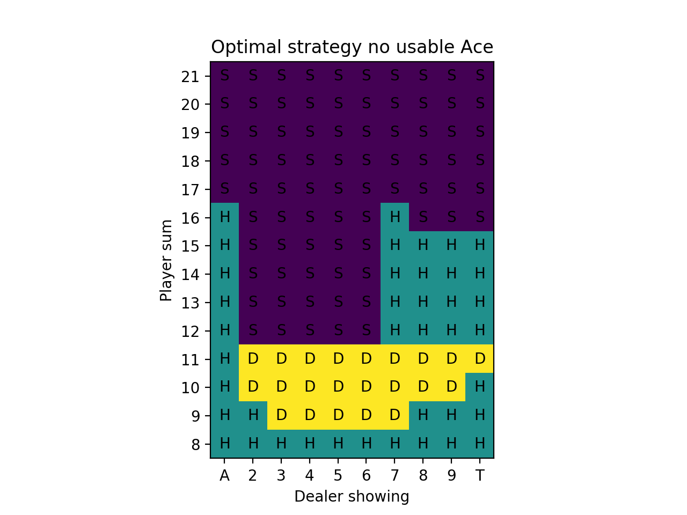
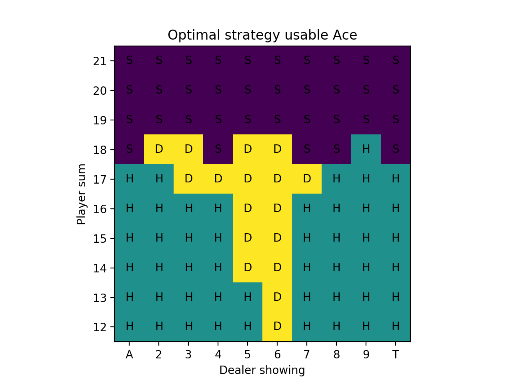

We can compare these to optimal strategy charts from [The Wizard of Odds](https://wizardofodds.com/games/blackjack/strategy/4-decks/). On these figures, S is for stick and H is for hit. Dh and Ds mean double if allowed, otherwise hit or stand, respectively. Rh is for surrender, which means folding the hand and losing only half of the bet, and when surrender isn't allowed, then hit. To simplify, we don't allow surrender or split, which is when you can convert a pair (e.g. 3-3) to two separate hands and double the total bet to have a single bet unit on each of those hands (Wizard of Odds has a separate chart for the splits that we omit here). The upper part is for "hard" hands, which means no usable Ace and the lower part is for "soft" hands, which have a usable Ace. 

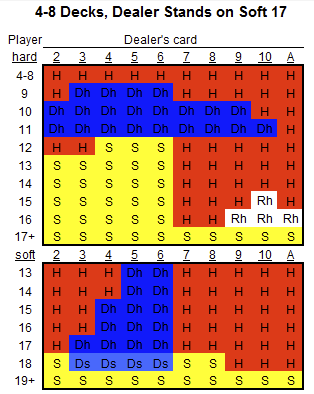

There are a few discrepencies like standing with 16 when the dealer has an 8/9/Ten in the Monte Carlo no usable Ace charts and standing on 18 vs. a dealer 8 and Ten in the usable Ace charts. These are likely very slightly in favor of the strategy shown on the Wizard of Odds chart and with more simulations would come to the same result. 

And for the value functions, we have: 

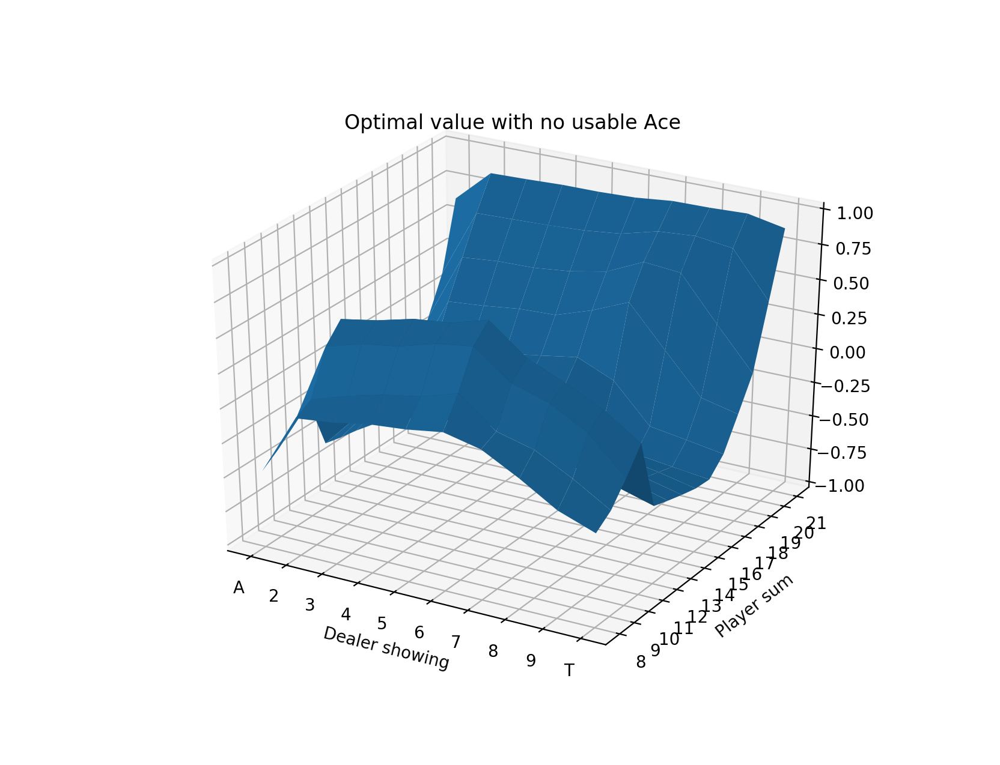
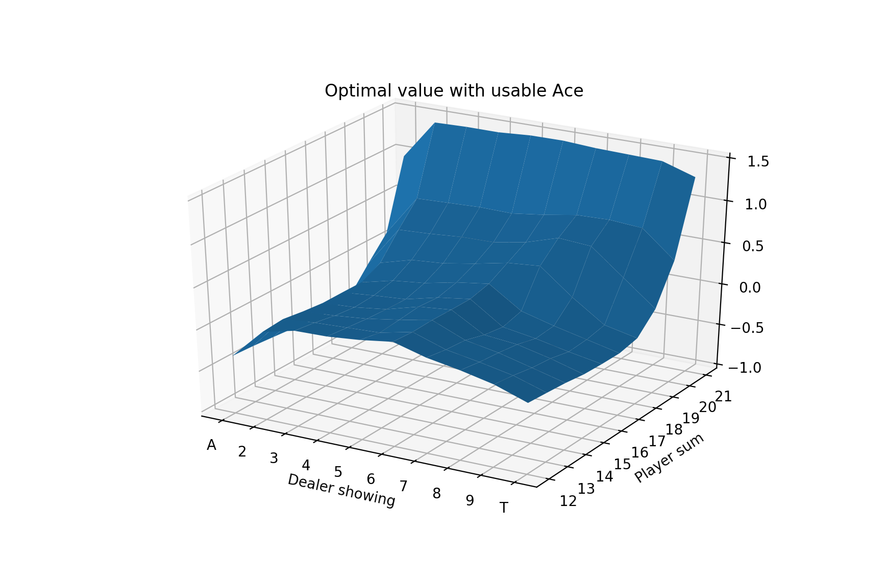

Over 5 million evaluation hands, we find an estimated win per hand of -0.008034, or losing about 0.80 cents per $1 bet. Indeed, this is much better than the previous result of -0.0474336 per hand. 

In a casino, we might expect to do even better because most casinos use 4-8 52-card decks rather than a simulated "infinite" deck as we have used here. This allows for a built-in advantage for getting a natural 21. Consider a 4-card deck. There are 208 cards of which 64 are valued as 10. This means a 30.77% chance of getting a 10-valued card on the first card (this is true regardless of deck size, including infinite decks). However, now what are the chances of getting an Ace? In an infinite deck, this probability is 7.69% (16/208 = 4/52). In a 4-card deck, this is 7.73% (16/207 since a single 10-valued card has already been dealt). The non-infinite decks also allow for the ability to "count" cards, a technique that involves counting to know when the deck is more or less favorable, and modifying bets based on that. 

## Monte Carlo Control with Seeing Both Dealer cards 
You're only supposed to see 1 dealer card. What if somehow the other flipped over and you saw both? Or maybe you somehow had [access to the hidden hole card](https://www.wired.com/story/stones-poker-cheating-scandal/)? How big of an advantage would this be? Normal strategy is to never hit on 19 because the risk of busting is so high. But if you saw that the dealer had 20, it would be mandatory to hit! 

Here are the value charts and strategy charts for seeing both dealer cards and also using the same Blackjack and doubling down rules from the prior section with 10 million simulated hands: 

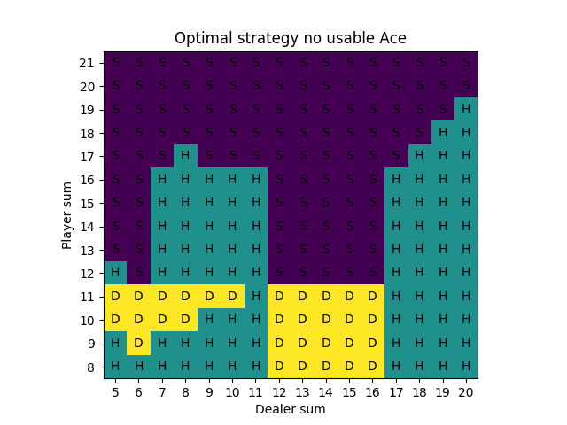
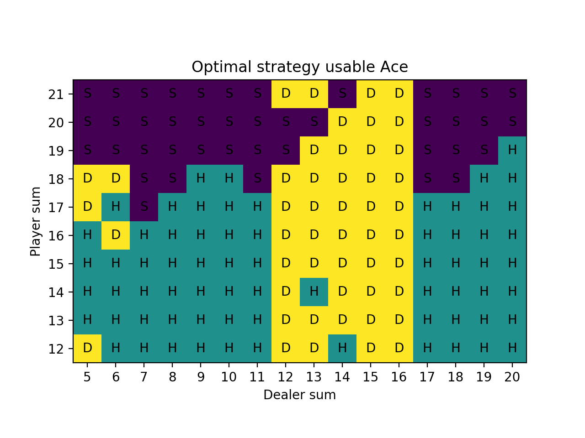

As expected, the player sum of 19 hits when the dealer is showing 20. 

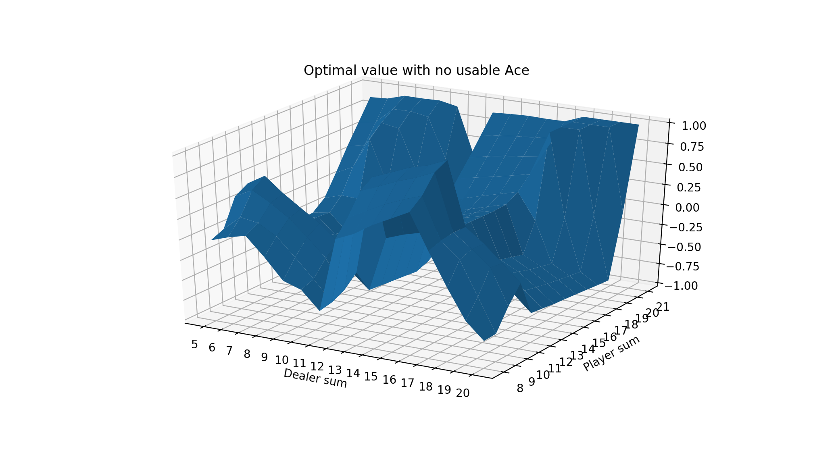
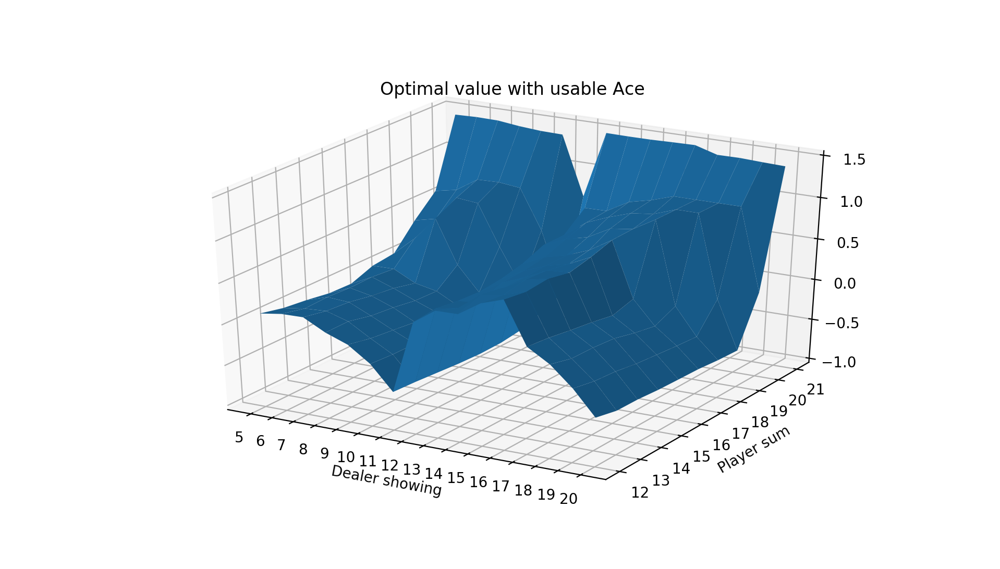

We again simulated 5 million hands after finding the optimal strategy. Now we find an estimated win per hand of 0.0856133. Not surprisingly, when you can see both of the dealer's cards, the game becomes profitable. The increase in profitability is about 9.36 cents per hand from the prior scenario (from losing 0.80 cents per hand to winning 8.56 cents per hand). 

## Importance Sampling Prediction
Previously we showed that we could learn the optimal strategy by using a near-optimal policy that allowed for some exploring. There is another approach that uses two policies, one that is learned about and becomes the optimal policy (target policy) and one that is exploratory and is used to generate behavior (behavior policy). This is called off-policy learning. 

The main idea is that we get returns from the behavior policy and take the ratio of the target policy divided by the behavior policy to represent the frequency of obtaining those returns under the target policy. 

The Sutton Barto book looks at a particular state in which the sum of the player cards are 13 and there is a usable Ace (i.e. Ace-2 or Ace-Ace-Ace). We take the target policy as sticking on 20 and 21 and hitting on everything else and the behavior policy of hitting or sticking 50% each. They determined that the value of this state under the target policy is -0.27726 (we are now again using the original rules with no natural blackjack and no doubling down). 

We perform 100 runs of 10,000 episodes (hands) all starting with the aforementioned starting state. 

After each episode, we compute the importance sampling ratio $$\rho$$, which is the target policy divided by the behavior policy. The behavior policy is always 0.5 by definition because regardless of the state, it is hitting 0.5 and sticking 0.5. The target policy is to always hit on 20 and 21 and to always stick otherwise. There are two cases:

$$\rho = \frac{1}{0.5} = 2$$

$$\rho = \frac{0}{0.5} = 0$$

The numerator is how frequent the action chosen by the behavioral policy is also chosen by the target policy. Since the target policy is fixed it is either always choosing that action or never choosing it, resulting in the above cases, respectively. 

We accumulate a $$\rho$$ importance sampling ratio and $$G$$ return for each episode and multiply them together to result in the weighted return. These are accumulated over all episodes, i.e. the final episode weighted return is the sum of all previous returns and the final return. 

Finally, to estimate the value of the state, we divide the weighted returns by the number of episodes for the ordinary case and divide by the $$\rho$$ values for the weighted case. The mean squared error of both are plotted below: 

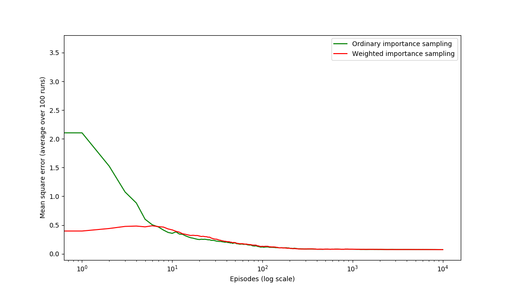


