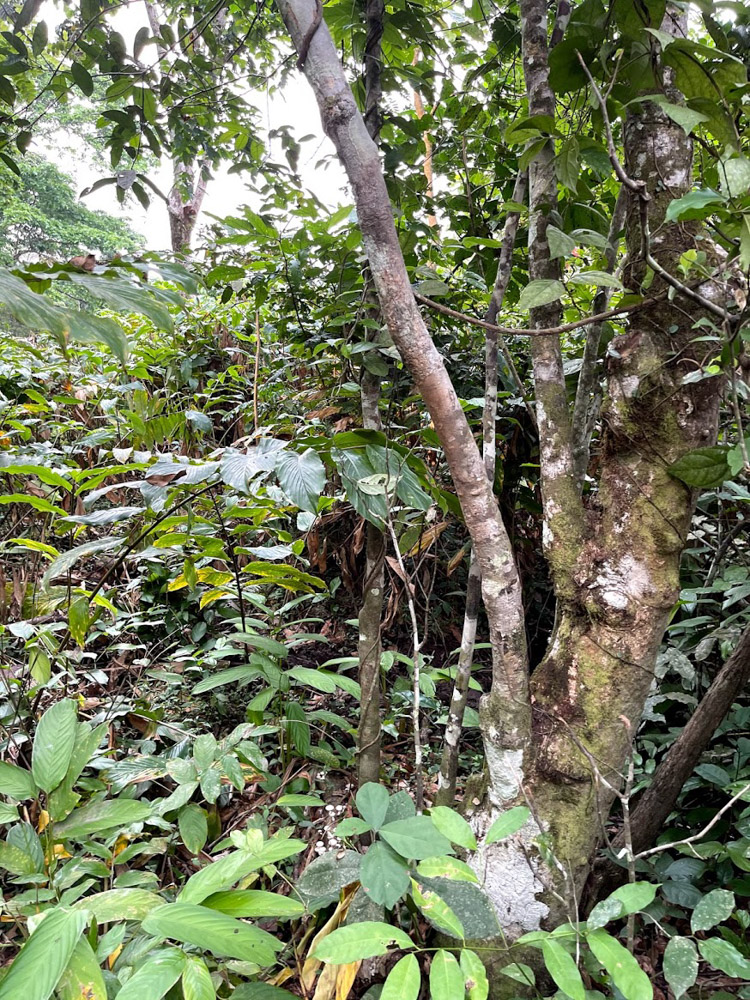
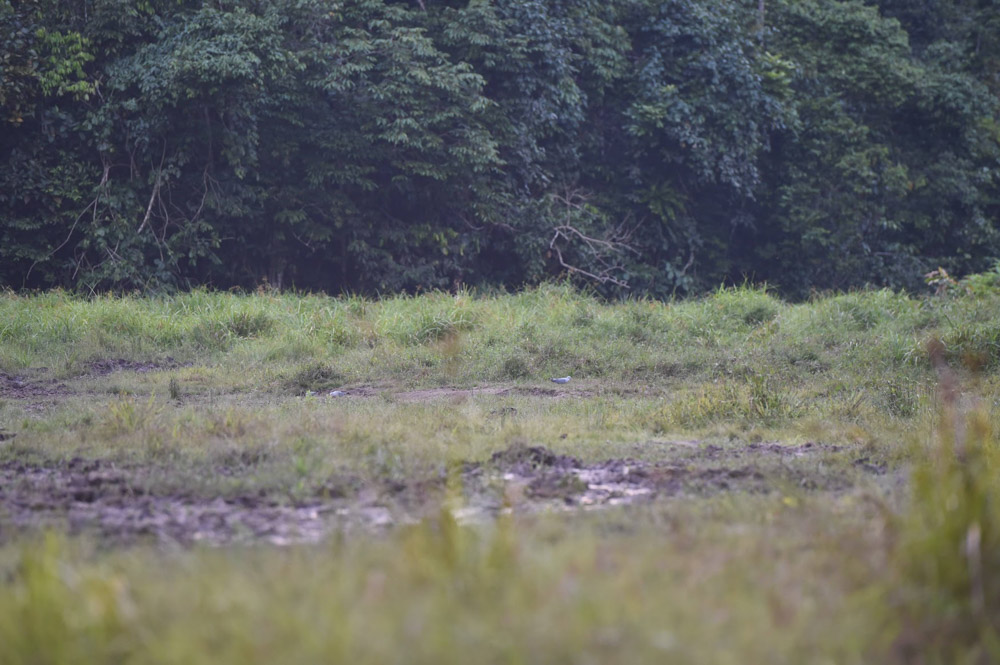

### Background
I arrived at Sangha Lodge in Central African Republic (CAR), adjacent to the Sangha-Dzangha National Park, in mid-December 2020. COVID was making  the situation in many cities uncomfortable, so this seemed like a perfect escape. I ended up staying for about 2 months and as I would, procrastinated taking this trip until the last week. 

The trails and nature right at the lodge are beautiful, with lots of opportunities to see birds and other small animals. The main attraction of the park is the Dzanga Bai (bai is the local language word for forest clearing, which is saline in French, I think), which is a forest clearing that up to 100 or so elephants congregate at every day. This one is particularly special for the elephants because there are many minerals in the ground for them to drink (some other animals also show up to partake). Visiting there is fantastic and I believe that it might actually be the best nature place in the world. This probably made me under-value the less dramatic, but also very cool non-elephant nature viewing opportunities around the lodge, which I appreciated more by the end of my stay. 

I had visited Dzanga Bai for two day trips in 2014 during my last visit and was planning to do one overnight visit during this trip, where I'd bring a tent and sleep on the platform. The thing about Dzanga Bai is that it's too easy. You show up and walk up the stairs to the wooden viewing platform (there is a ~2 km walk to get there from the car dropoff at least) and instantly see this amazing scene. Other than a bit of an ant infestation (up there with the most annoying ant scenarios I've been in), and being a little overwhelmed from a photographic sense, this is bliss. 

The thing I didn't realize during my first visit is that there are in fact quite a few bais in addition to Dzanga Bai. The national park offers a "bai walk" as an activity. It wasn't exactly clear to me what this means, but I was imagining getting to Bai 1, seeing elephants, walking to Bai 2, seeing elephants, and then leaving. The park was technically closed while I was there due to COVID, so I still don't know exactly what this activity entails. 

Sangha Lodge has its own concession adjacent to the park and so it was decided that some kind of forest walking activity would happen, probably similar to the official park bai walk, but our own unofficial version. Since I've somehow over the past years become an avid walker/hiker and have built up a strong interest in elephants, this was a pretty ideal activity. 

### Planning 
There is absolutely no official route or plan and my usual travel planning go-to of Google Maps was useless here. It sounded like regular guests never/rarely do this kind of thing, but some long-term visitors or lodge employees have done walks in this area. I had previously been to the area under discussion for this walk for a day trip to download camera trap data, but hadn't seen any bais or large animals. 

After some talks with Rod and Tamar -- the Sangha Lodge owners, we decided that a 3 day/2 night "bai walk" trip would work well, though one extra day may be best in retrospect. We would drive from the lodge about 30km to the "Libwe" road dropoff point and from there walk over the next 3 days mostly through the forest and then through a road parallel to Libwe and eventually back to the lodge, while trying to visit a bunch of bais and see as much wildlife as we could. 

The white north/south road is the "main" road of the area, which is a dirt road in pretty good condition. The Libwe road runs east-west from the white road to the green marker and the green marker is where we were dropped to start the trip. The two red markers in the center were the overnight spots and the horizontal line to the left is the Saint Francois Road that runs parallel to the Libwe road. The final red marker is Sangha Lodge. 

At the start all I knew is that we'd start at the Libwe Road and get to the Saint Francois Road and walk through many bais en route. 

We decided that I'd go with Armand, one of the senior staff at the lodge, and three Ba'aka people -- Bosco, Lundi, and Congondele. I think we technically could have done this with only 1-2 people, but having more meant once we got to a campsite we could look in different directions for signs of elephants and other animals. And the general principle of "the more the merrier" applied here since I got to hang out with them and they had more company amongst themselves as well. 

### Food
Two days before leaving, we made a list of all the expenses and food (most things on the list not for me, for the others). I did get addicted to biscuits during this period and am not really sure why I chose spaghetti instead of rice since rice could've been cooked in a much smaller pot. Also it's nice to be in a place where avocados are way cheaper than spaghetti. 

I love this kind of traveling/pricing because it's fun to be fully responsible for how things go, and also I'm very picky and enjoy transparent pricing :). 

### Gear
I was a little unsure of what to expect and therefore also of what to carry. Gear was pretty easy -- tent, sleeping bag, camping mattress, water (note: bring a filter so you don't have to use bottles), and food. I've gotten a bit into trying to pack super light, aka ultralight, which would mean things like having a maximum of 2 underwear, 2 socks, 2 shirts even for a very long trip, and maybe less for this short of a trip, but the thing is this area is super humid and muddy and so those rules shouldn't exactly apply. I tend to go a little hard on these new travel concepts, like after I got into the "little planning, go with the flow", I went to Nepal and maybe overdid it by not using a guide and finding a random guy to be our porter, which ended up not going that well because there was a huge avalanche and the porter and I both got snowblinded, and he didn't really give very good advice, although it could've been much worse, and so now I try to be more case-specific with my travel methods. The point being that I should have probably packed more things to stay warm/comfortable.

As for camera lenses, I was deciding between a 24-70mm, 70-200mm, or both. I went with a 70-200 to be sure I'd be capable of reaching birds and elephants from far away, and figured I'd use my iPhone for shorter range stuff. The majority of photos did end up being shorter range, but having the long lens was nice (I was expecting it to be too annoying to change lenses in the forest). 

So in the end I went with a Nikon D4s with 70-200mm f2.8 lens and my iPhone 12 Pro Max. 

### Day 1: Getting to the beginning
On Monday morning February 9th it was time to go! The five of us going on the trip would travel in the pick-up truck. Two others would join for getting us to the dropoff point: Emy as the pick-up driver and Yaf as the "when a tree has fallen in the road I will fix it" specialist, who would take a motorbike and ride in front of us. 

Due to some slight delays (me procrasta-packing), we started leaving at around 7:30am. There was a small mechanical issue with the car that got fixed pretty quickly and then we drove the 3km on the Sangha Lodge road and another couple km to get to Bobongo village to stop off at Armand's house to pick up the food that he had bought the day before and to see his large family. 

It was fun to see his house and get a quick peek at his village and family. 

The avocados had some problems: 

Some family members were around the house: 

From there we proceeded at about 8:30am a bit more on the main road and then turned off onto the Libwe road, which is not the best or best maintained road. 

At 8:45am we ran into a bit of a roadblock, which was dealt with. I admit that prior to this incident I was a little skeptical of traveling with a dedicated man to fix roadblocks, but that changed pretty immediately here! 

The whole crew immediately sprang into action and cleared the road super-fast with a combination of machetes and Yaf's electric saw. 

### Day 1: Beginning the walk
By about 10:15am we finally got to our drop-off point. It was there that I realized that only Armand and Congondele had brought backpacks and Congondele's looked like the kind of bag you'd bring to not get charged on a Spirit Airlines flight (i.e. very small), not a bag to carry lots of gear in the forest! 

It turns out that the Ba'aka people are insanely resourceful when it comes to the forest and so Bosco was already working on building his own backpack out of forest vines and such. Lundi was making more of a wrap thing to attach a few bags together. 

Once these were ready, we got moving. There are some trails in the forest here, but they're kind of for elephants and mostly pretty rough. The Ba'aka walked in front with machetes and would chop off some obstructions, but it's very tough to avoid tripping and getting scratched. It's basically walking on level extra hard. It is generally flat, so there aren't major issues with getting out of breath, it's just literally hard to walk. 

We came across a fisherman who got me very excited by telling me that there were a bunch of elephants at the nearby bai. 

15 minutes or so later we arrived at the first bai that was unfortunately completely empty. 

The bais were also muddy at a level of mud that I had never experienced before: 

After the first bai we proceeded to walk in the forest a bit more. 

Lundi stood inside a tree: 

Then we got to another bai that is meant to have very high density elephant: 

We stayed there to see if anything would come until sunset: 

But nothing showed up: 

A rough day and evidence that I should not be photographed with light directly overhead: 

Unfortunately we did not see any animals during the first day, but there was plentiful spaghetti: 

### Day 2: More walking

The Ba'aka people that I was with know the forest ridiculously well. They use no GPS or tracking devices or electronics, just pure memory and skill from living in these forests their whole lives. They were suspecting that the elephants might have been avoiding the bais because they knew we were there and also said that the best chance of seeing them would be as the sun comes up or goes down, so we got up early to take a look at the bai nearby. 

Unfortunately I woke up like this: 

Our campsite looked like this: 

And featured many bees: 

The bai was looking nice in the morning: 

And slightly later in the morning: 

But unfortunately we again did not see any animals. After that we briefly went back to the camp and then continued walking in the forest with the intention of seeing another bai or two. 

We saw a small snake: 

Then continued: 

Me happy to be in this special place but not exactly showing it in the moment: 

And got to another bai that was also empty: 

Though we did see some elephant prints on the ground that were recent: 

After this we headed back to the campsite where my shoes began to grow flowers:  

At this point it wasn't seeming too likely that we'd see elephants at all on this trip, even though we still had two "peak periods" remaining -- the final sunset and the next day's final sunrise for the trip. 

Mid-day was a good time to take it easy and relax, so while Armand and I stayed there, the other three went off. I didn't really know what they were doing, but through some very advanced-level forest methods, they managed to come across a small group of elephants. They came back and let us know and we immediately got up to go see them. 

The mud situation continued to be very difficult: 

After a 20-30 minute walk, they told me that we were approaching and I took a basically unidentifiable photo: 

Then we got a bit closer and I got an identifiable but blurry shot: 

Then we got a bit closer and got out of the denser forest and into a more open area. I had to climb into the middle of this tree to get a reasonable viewing angle: 

And we got the first legit view! 

But then they started walking away: 

After this, we had to reposition to be able to see them again, but this involved walking in a sort of very large semi-circle. This was a pretty tense walk because (a) we wanted to do it fast in case they went away completely and (b) there were insanely deep mud patches everywhere. My entire foot would get stuck deep in mud and I had to figure out a technique to keep my shoe from falling off by pushing up my toes, which I only put into practice after my shoe came off entirely once. 

Once we got to Good Viewing Area B, another tree had to be climbed, this time a legit climb. The only time I broke my leg in my life was from jumping off of a 3' high backyard deck, which was probably like 2% as dangerous as this situation. This photo is from the tree next to the one I got into, but unfortunately you can't really see the wide view: 

After getting into that tree I was able to take one of my favorite photos:  

It felt magical getting up into that tree and seeing those elephants. 

After a few minutes, we had to get going out of fear that the elephants could potentially come in our direction. 

We went to one additional bai and did a little photo shoot. 

Armand: 

Congondele: 

We also saw some birds, flying: 

And on the ground: 

We then headed back to our new campsite and ate the exact same thing we ate the night before. 

### Day 3: Heading home
On the final morning, we packed up: 

And passed through one final bai: 

Then through the forest a bit more: 

Then we spent most of the time walking on the Saint Francois Road: 

Fire ants were the scariest and nastiest thing about my trip to CAR and here are a bunch being run over by a motorbike on the main local road: 

We ended on the 3km road to Sangha Lodge: 

