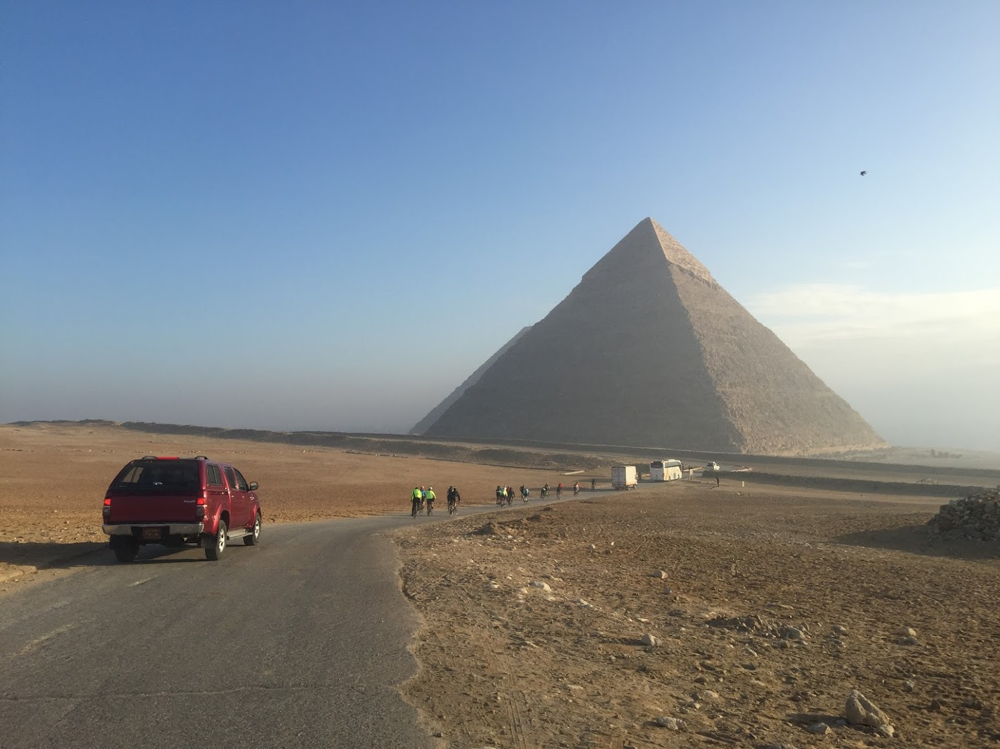
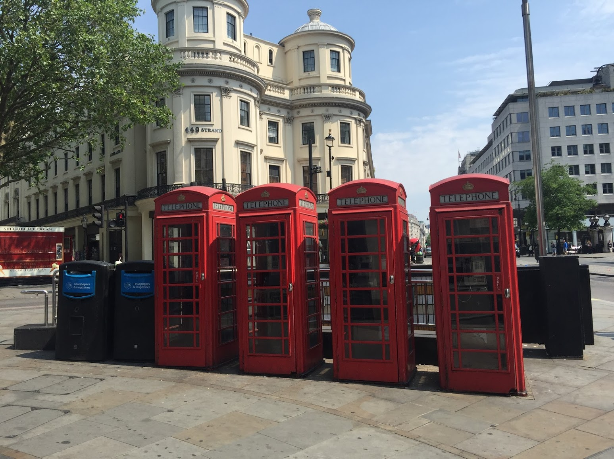
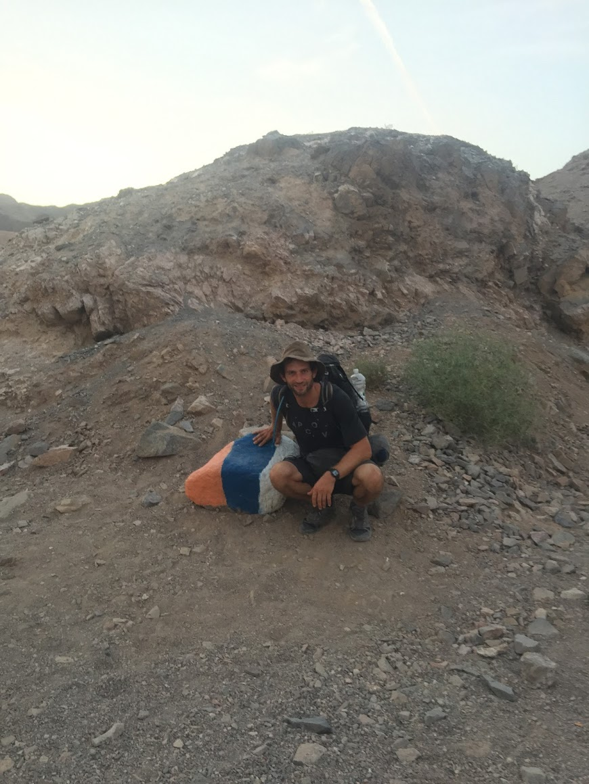

## Why travel? 
Sometimes traveling is a very practical and purpose-based means of getting around. Travel to visit friends, travel to attend events, travel to a business meeting, travel to a better climate in the winter. You really can't go wrong with practical travel! 

It can be fun to gameify travel ambitions that go beyond the practical with bucket lists and goals. Here we list a bunch of travel goals/ideas. 

If you've been keeping track in your head or on a spreadsheet or on a scratch-off map on the wall, check out [Equator](https://www.eqtr.co) where you can keep track of your continents, countries, and states visited -- to see your own progress and to share with friends. We're working on even more things to track for the future. 

## The Big Trip
The thing about the big trip is that you can do things that are impossible with a 1 or 2 week maximum trip length that is so common in the real world! In addition to having the luxury of time and "going with the flow", there are lots of fun things to do that take months. 

### Backpacking
The gap year or after-army year or whatever your case may be is really the ultimate sense of freedom trip! You've been constrained by some system for years and suddenly are completely free and in a completely new place with flexibility to do what you like. 

### Sabbatical
This is the "grown up" version of the big trip that people get to take between jobs or as a break from a job or after some big achivement like selling a company or graduating. 

### Remote Work
As more and more work goes remote, 

### The Speed Trip
So the big trip doesn't necessarily require a lot of time -- with frequent and low cost air travel it can be possible to go around the world on a whirlwind trip. I think this is generally a bad idea (and if you try posting in travel forums everyone will quickly say the same), but perhaps has its place in situations like a crazy honeymoon or something Casey Neistat did when he visited four countries in 10 days in this awesome video: 

## The Bucket List Items

### Reach the Seven Summits

### Safari in Africa

### Trans Siberian Rail

### Overland Cairo to Cape Town
This is the classic overland route with many companies running trucks back and forth throughout the year, taking stops at important places along the way like Nairobi, the Serengeti, and Victoria Falls (although the best part is probably seeing all of the day to day stuff in between). [TDA Global Cycling](https://tdaglobalcycling.com/tour-dafrique) even runs a 4-month supported bike tour through 10 countries on this route. 

### Seeing major world cities
Iconic world cities are iconic for a reason -- here are some of the best:
1. London
2. NYC
3. Hong Kong
4. Tokyo
5. Dubai
6. Paris
7. Istanbul
8. Singapore
9. Los Angeles
10. Chicago

### The Really Long/Difficult Thing
My absolute favorite travel experiences have been doing the "long/difficult" thing. The main ones for me have been hiking for 1.5 months in Israel and cycling the Tour d'Afrique (mentioned above). Long active trips make sense, but also a period of volunteering or learning a language could certainly qualify here. Getting that big sense of accomplishment at the end is a great feeling! 

## Useful Goals

### Learn languages
Being in an actual foreign country where your target language is spoken is a great way to improve at the language. These days, video lessons can be done from anywhere and going to a country as a complete beginning might not be that fruitful because it can be very tough to communicate in normal situations, but being able to spend a few weeks or months immersed in a language can be way better than years of school classes! 

Scott Young did a really cool [year abroad learning languages](https://www.scotthyoung.com/blog/myprojects/the-year-without-english-2/), where he went between four countries for three months each attempting to speak no English whatsoever for the whole time! 

## Geographic Goals

### Visit every continent
The OG of geographic goals is to visit each of the seven continents. 

The idea of experiencing cultures in every continent makes a lot of sense as a simple criteria to "get to know" the world! As a practical matter it'd probably be better if the Middle East/North Africa counted as its own since it's so different from Asia and Africa, where it technically belongs. Also Antarctica is in fact a continent, but most visitors take a boat and experience the continent for only a day! 

### Visit every country
There are 193 UN countries in the world 

### Visit every state
This US-centric goal is a fun one for Americans especially because many people by default get a pretty good start on visiting the 50 states and it seems fun to "get to know" your own country better. Also there are lots of highlights in less typically visited states like Yellowstone in Wyoming and Mount Rushmore in South Dakota.

### Visit every territory
What does this even mean? Well some people have tried to define territories and have been able to break up the world into about 1500 different parts, which varies depending on methodology. We think that this is a bit crazy since it means A LOT of travel and a lot of going to weird islands that no tourists really visit and such things like that. 

### "Do this (possibly weird) thing in every place"
Some people collect stamps, other people collect the experience of doing a thing in every place they visit. Some ideas: 
1. A handstand photo
2. Playing golf
3. Carrots in a market (probably requires unusually strange interest in carrots)
4. Drinking a coke
5. Eating at McDonald's (where available)

## Luxury 

### Stay at every Aman Resort
[Aman](https://www.aman.com/) is an extreme luxury hotel chain with only 38 properties as of March, 2021. They are generally in very unique nature-oriented locations and have the strongest presence in Asia. They are known to be ridiculously luxurious, granting any reasonable request and rewarding repeat customers by knowing all of their preferences and possibly giving gifts. This makes visiting every resort a fun, albeit insanely expensive, idea.  

### Eat at every Michelin 3-star or 50-best list restaurant
Every year there are new lists by Michelin that rate restaurants either 1, 2, or 3 stars (getting any star at all is still very good!). As of this writing there are 132 [Michelin 3-star restaurants](https://en.wikipedia.org/wiki/List_of_Michelin_3-star_restaurants) in 15 countries, with over half of them being in the combination of France/Japan/USA. This makes eating at all of them somewhat realistic, although the list changes frequently! 

[The World's 50 Best Restaurants](https://www.theworlds50best.com/list/1-50) is the other top restaurant ranking and while the list is much smaller, it's also relatively much more geographically diverse. Could this be done in a single year? 

## The Anti-Travel

### Stay in one place for a year
For the travel inclined, sometimes there is really no place like home. At home everything tends to work, the internet is fast, friends are around, all the food is available, working out at the gym is easy, etc.! Traveling for the sake of it can be very tempting and while we are big advocates of travel, it can be draining and can cost a lot of time logistically, so sometimes it makes sense to take a break. 